<!-- GENERATED:MODEL -->
---
tags: [odoo, enterprise, generated, model]
---

# mail.activity.type

- Module: [[docs/Enterprise Addons/sign/sign|sign]]
- Scope: Enterprise Addons
- Defined in module: extension only
- Source files: `models/mail_activity_type.py`
- Python classes: `MailActivityType`

## Field footprint

- Detected fields: 2
- Field types: `Many2one` x 1, `Selection` x 1
- Relation fields: 1

## Sample fields

- `category`: `Selection`
- `default_sign_template_id`: `Many2one` (comodel `sign.template`)

## Method hints

- Detected methods: 0
- Action methods: none
- Compute methods: none
- Onchange methods: none

## Direct relation diagram

```plantuml
@startuml
!define ODOO_COLOR_PRIMARY #714B67
!define ODOO_COLOR_ACCENT #875A7B
!define ODOO_COLOR_BG #FAF7FA

skinparam backgroundColor ODOO_COLOR_BG
skinparam defaultTextAlignment left
skinparam ArrowColor ODOO_COLOR_ACCENT
skinparam ClassBackgroundColor white
skinparam ClassBorderColor ODOO_COLOR_PRIMARY
skinparam ComponentBackgroundColor white
skinparam ComponentBorderColor ODOO_COLOR_PRIMARY
skinparam NoteBackgroundColor #FFF8FF
skinparam NoteBorderColor ODOO_COLOR_ACCENT
skinparam SequenceLifeLineBorderColor ODOO_COLOR_ACCENT
skinparam SequenceLifeLineBackgroundColor #FFFFFF
skinparam SequenceParticipantBorderColor ODOO_COLOR_PRIMARY
skinparam SequenceParticipantBackgroundColor #FFFFFF
skinparam sequence {
  ArrowColor ODOO_COLOR_ACCENT
  ActorBorderColor ODOO_COLOR_PRIMARY
}
title mail.activity.type - Direct Relations
class "mail.activity.type" as mail_activity_type
class "sign.template" as sign_template
mail_activity_type --> sign_template : default_sign_template_id
@enduml
```

## Navigation

- **Parent:** [[docs/Enterprise Addons/sign/Models]]

<!-- GENERATED:MODEL -->
