<!-- GENERATED:MODEL -->
---
tags: [odoo, enterprise, generated, model]
---

# res.config.settings

- Module: [[docs/Enterprise Addons/sign/sign|sign]]
- Scope: Enterprise Addons
- Defined in module: extension only
- Source files: `models/res_config_settings.py`
- Python classes: `ResConfigSettings`

## Field footprint

- Detected fields: 9
- Field types: `Boolean` x 5, `Html` x 2, `Many2one` x 1, `Selection` x 1
- Relation fields: 1

## Sample fields

- `group_manage_template_access`: `Boolean`
- `module_sign_emsigner`: `Boolean`
- `module_sign_itsme`: `Boolean`
- `sign_preview_ready`: `Boolean` (compute `_compute_sign_terms_preview`)
- `sign_terms`: `Html` (related `company_id.sign_terms`)
- `sign_terms_html`: `Html` (related `company_id.sign_terms_html`)
- `sign_terms_type`: `Selection` (related `company_id.sign_terms_type`)
- `signing_certificate_id`: `Many2one` (comodel `certificate.certificate`, related `company_id.signing_certificate_id`)
- `use_sign_terms`: `Boolean`

## Method hints

- Detected methods: 2
- Action methods: `action_update_sign_terms`
- Compute methods: `_compute_sign_terms_preview`
- Onchange methods: none

## Direct relation diagram

```plantuml
@startuml
!define ODOO_COLOR_PRIMARY #714B67
!define ODOO_COLOR_ACCENT #875A7B
!define ODOO_COLOR_BG #FAF7FA

skinparam backgroundColor ODOO_COLOR_BG
skinparam defaultTextAlignment left
skinparam ArrowColor ODOO_COLOR_ACCENT
skinparam ClassBackgroundColor white
skinparam ClassBorderColor ODOO_COLOR_PRIMARY
skinparam ComponentBackgroundColor white
skinparam ComponentBorderColor ODOO_COLOR_PRIMARY
skinparam NoteBackgroundColor #FFF8FF
skinparam NoteBorderColor ODOO_COLOR_ACCENT
skinparam SequenceLifeLineBorderColor ODOO_COLOR_ACCENT
skinparam SequenceLifeLineBackgroundColor #FFFFFF
skinparam SequenceParticipantBorderColor ODOO_COLOR_PRIMARY
skinparam SequenceParticipantBackgroundColor #FFFFFF
skinparam sequence {
  ArrowColor ODOO_COLOR_ACCENT
  ActorBorderColor ODOO_COLOR_PRIMARY
}
title res.config.settings - Direct Relations
class "res.config.settings" as res_config_settings
class "certificate.certificate" as certificate_certificate
res_config_settings --> certificate_certificate : signing_certificate_id
@enduml
```

## Navigation

- **Parent:** [[docs/Enterprise Addons/sign/Models]]

<!-- GENERATED:MODEL -->
