<!-- GENERATED:MODEL -->
---
tags: [odoo, enterprise, generated, model]
---

# sign.document

- Module: [[docs/Enterprise Addons/sign/sign|sign]]
- Scope: Enterprise Addons
- Defined in module: yes
- Source files: `models/sign_document.py`
- Python classes: `SignDocument`
- Description: Signature Document

## Field footprint

- Detected fields: 7
- Field types: `Binary` x 1, `Char` x 1, `Integer` x 2, `Many2one` x 2, `One2many` x 1
- Relation fields: 3

## Sample fields

- `attachment_id`: `Many2one` (comodel `ir.attachment`)
- `datas`: `Binary` (related `attachment_id.datas`)
- `name`: `Char` (comodel `Name`, related `attachment_id.name`)
- `num_pages`: `Integer` (comodel `Number of pages`, compute `_compute_num_pages`, store `True`)
- `sequence`: `Integer`
- `sign_item_ids`: `One2many` (comodel `sign.item`)
- `template_id`: `Many2one` (comodel `sign.template`)

## Method hints

- Detected methods: 15
- Action methods: none
- Compute methods: `_compute_num_pages`
- Onchange methods: none

## Direct relation diagram

```plantuml
@startuml
!define ODOO_COLOR_PRIMARY #714B67
!define ODOO_COLOR_ACCENT #875A7B
!define ODOO_COLOR_BG #FAF7FA

skinparam backgroundColor ODOO_COLOR_BG
skinparam defaultTextAlignment left
skinparam ArrowColor ODOO_COLOR_ACCENT
skinparam ClassBackgroundColor white
skinparam ClassBorderColor ODOO_COLOR_PRIMARY
skinparam ComponentBackgroundColor white
skinparam ComponentBorderColor ODOO_COLOR_PRIMARY
skinparam NoteBackgroundColor #FFF8FF
skinparam NoteBorderColor ODOO_COLOR_ACCENT
skinparam SequenceLifeLineBorderColor ODOO_COLOR_ACCENT
skinparam SequenceLifeLineBackgroundColor #FFFFFF
skinparam SequenceParticipantBorderColor ODOO_COLOR_PRIMARY
skinparam SequenceParticipantBackgroundColor #FFFFFF
skinparam sequence {
  ArrowColor ODOO_COLOR_ACCENT
  ActorBorderColor ODOO_COLOR_PRIMARY
}
title sign.document - Direct Relations
class "sign.document" as sign_document
class "ir.attachment" as ir_attachment
class "sign.item" as sign_item
class "sign.template" as sign_template
sign_document --> ir_attachment : attachment_id
sign_document --> sign_template : template_id
sign_document --|> sign_item : sign_item_ids
@enduml
```

## Navigation

- **Parent:** [[docs/Enterprise Addons/sign/Models]]

<!-- GENERATED:MODEL -->
