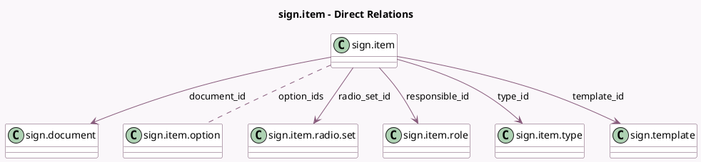

<!-- GENERATED:MODEL -->
---
tags: [odoo, enterprise, generated, model]
---

# sign.item

- Module: [[docs/Enterprise Addons/sign/sign|sign]]
- Scope: Enterprise Addons
- Defined in module: yes
- Source files: `models/sign_item.py`
- Python classes: `SignItem`
- Description: Fields to be sign on Document

## Field footprint

- Detected fields: 17
- Field types: `Boolean` x 2, `Char` x 2, `Float` x 4, `Integer` x 3, `Many2many` x 1, `Many2one` x 5
- Relation fields: 6

## Sample fields

- `alignment`: `Char`
- `constant`: `Boolean`
- `document_id`: `Many2one` (comodel `sign.document`)
- `height`: `Float`
- `name`: `Char`
- `num_options`: `Integer` (related `radio_set_id.num_options`)
- `option_ids`: `Many2many` (comodel `sign.item.option`)
- `page`: `Integer`
- `posX`: `Float`
- `posY`: `Float`
- `radio_set_id`: `Many2one` (comodel `sign.item.radio.set`)
- `required`: `Boolean`
- `responsible_id`: `Many2one` (comodel `sign.item.role`)
- `template_id`: `Many2one` (comodel `sign.template`, related `document_id.template_id`)
- `transaction_id`: `Integer`
- `type_id`: `Many2one` (comodel `sign.item.type`)
- `width`: `Float`

## Method hints

- Detected methods: 5
- Action methods: none
- Compute methods: none
- Onchange methods: none

## Direct relation diagram

## Navigation

- **Parent:** [[docs/Enterprise Addons/sign/Models]]

<!-- GENERATED:MODEL -->
