<!-- GENERATED:MODEL -->
---
tags: [odoo, enterprise, generated, model]
---

# sign.item.type

- Module: [[docs/Enterprise Addons/sign/sign|sign]]
- Scope: Enterprise Addons
- Defined in module: yes
- Source files: `models/sign_item_type.py`
- Python classes: `SignItemType`
- Description: Signature Item Type

## Field footprint

- Detected fields: 12
- Field types: `Boolean` x 1, `Char` x 6, `Float` x 2, `Many2one` x 1, `Selection` x 2
- Relation fields: 1

## Sample fields

- `active`: `Boolean` (comodel `Active`)
- `auto_field`: `Char`
- `default_height`: `Float` (compute `_compute_dimensions`)
- `default_width`: `Float` (compute `_compute_dimensions`)
- `field_size`: `Selection`
- `icon`: `Char`
- `item_type`: `Selection`
- `model_id`: `Many2one` (comodel `ir.model`)
- `model_name`: `Char` (related `model_id.model`)
- `name`: `Char`
- `placeholder`: `Char`
- `tip`: `Char`

## Method hints

- Detected methods: 2
- Action methods: none
- Compute methods: `_compute_dimensions`
- Onchange methods: none

## Direct relation diagram

```plantuml
@startuml
!define ODOO_COLOR_PRIMARY #714B67
!define ODOO_COLOR_ACCENT #875A7B
!define ODOO_COLOR_BG #FAF7FA

skinparam backgroundColor ODOO_COLOR_BG
skinparam defaultTextAlignment left
skinparam ArrowColor ODOO_COLOR_ACCENT
skinparam ClassBackgroundColor white
skinparam ClassBorderColor ODOO_COLOR_PRIMARY
skinparam ComponentBackgroundColor white
skinparam ComponentBorderColor ODOO_COLOR_PRIMARY
skinparam NoteBackgroundColor #FFF8FF
skinparam NoteBorderColor ODOO_COLOR_ACCENT
skinparam SequenceLifeLineBorderColor ODOO_COLOR_ACCENT
skinparam SequenceLifeLineBackgroundColor #FFFFFF
skinparam SequenceParticipantBorderColor ODOO_COLOR_PRIMARY
skinparam SequenceParticipantBackgroundColor #FFFFFF
skinparam sequence {
  ArrowColor ODOO_COLOR_ACCENT
  ActorBorderColor ODOO_COLOR_PRIMARY
}
title sign.item.type - Direct Relations
class "sign.item.type" as sign_item_type
class "ir.model" as ir_model
sign_item_type --> ir_model : model_id
@enduml
```

## Navigation

- **Parent:** [[docs/Enterprise Addons/sign/Models]]

<!-- GENERATED:MODEL -->
