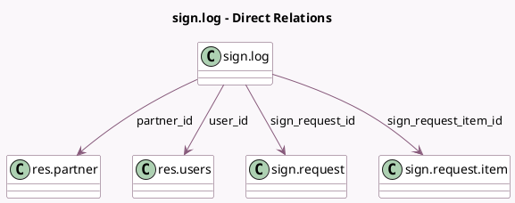

<!-- GENERATED:MODEL -->
---
tags: [odoo, enterprise, generated, model]
---

# sign.log

- Module: [[docs/Enterprise Addons/sign/sign|sign]]
- Scope: Enterprise Addons
- Defined in module: yes
- Source files: `models/sign_log.py`
- Python classes: `SignLog`
- Description: Sign requests access history

## Field footprint

- Detected fields: 12
- Field types: `Char` x 3, `Datetime` x 1, `Float` x 2, `Many2one` x 4, `Selection` x 2
- Relation fields: 4

## Sample fields

- `action`: `Selection`
- `ip`: `Char` (comodel `IP address of the visitor`)
- `latitude`: `Float`
- `log_date`: `Datetime`
- `log_hash`: `Char`
- `longitude`: `Float`
- `partner_id`: `Many2one` (comodel `res.partner`)
- `request_state`: `Selection`
- `sign_request_id`: `Many2one` (comodel `sign.request`)
- `sign_request_item_id`: `Many2one` (comodel `sign.request.item`)
- `token`: `Char`
- `user_id`: `Many2one` (comodel `res.users`)

## Method hints

- Detected methods: 8
- Action methods: none
- Compute methods: `_compute_string_to_hash`
- Onchange methods: none

## Direct relation diagram

## Navigation

- **Parent:** [[docs/Enterprise Addons/sign/Models]]

<!-- GENERATED:MODEL -->
