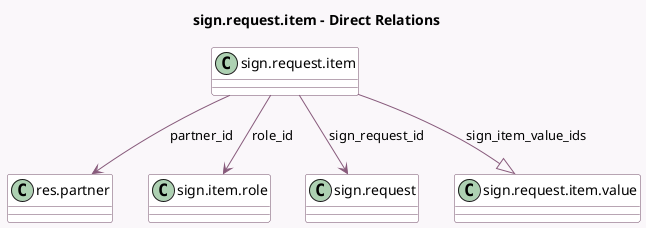

<!-- GENERATED:MODEL -->
---
tags: [odoo, enterprise, generated, model]
---

# sign.request.item

- Module: [[docs/Enterprise Addons/sign/sign|sign]]
- Scope: Enterprise Addons
- Defined in module: yes
- Source files: `models/sign_request_item.py`
- Python classes: `SignRequestItem`
- Description: Signature Request Item
- Inherits: `portal.mixin`

## Field footprint

- Detected fields: 23
- Field types: `Binary` x 1, `Boolean` x 4, `Char` x 7, `Date` x 1, `Float` x 2, `Integer` x 2, `Many2one` x 4, `One2many` x 1, `Selection` x 1
- Relation fields: 5

## Sample fields

- `access_token`: `Char`
- `access_via_link`: `Boolean` (comodel `Accessed Through Token`)
- `change_authorized`: `Boolean` (related `role_id.change_authorized`)
- `color`: `Integer` (compute `_compute_color`)
- `communication_company_id`: `Many2one` (related `sign_request_id.communication_company_id`)
- `display_name`: `Char`
- `frame_hash`: `Char` (compute `_compute_frame_hash`)
- `is_mail_sent`: `Boolean`
- `latitude`: `Float`
- `longitude`: `Float`
- `mail_sent_order`: `Integer`
- `partner_id`: `Many2one` (comodel `res.partner`)
- `reference`: `Char` (related `sign_request_id.reference`)
- `role_id`: `Many2one` (comodel `sign.item.role`)
- `sign_item_value_ids`: `One2many` (comodel `sign.request.item.value`)
- `sign_request_id`: `Many2one` (comodel `sign.request`)
- `signature`: `Binary`
- `signed_without_extra_auth`: `Boolean` (comodel `Signed Without Extra Authentication`)
- `signer_email`: `Char` (compute `_compute_email`, store `True`)
- `signing_date`: `Date` (comodel `Signed on`)

## Method hints

- Detected methods: 33
- Action methods: none
- Compute methods: `_compute_access_url`, `_compute_color`, `_compute_display_name`, `_compute_email`, `_compute_frame_hash`
- Onchange methods: none

## Direct relation diagram

## Navigation

- **Parent:** [[docs/Enterprise Addons/sign/Models]]

<!-- GENERATED:MODEL -->
