<!-- GENERATED:MODEL -->
---
tags: [odoo, enterprise, generated, model]
---

# sign.request.item.value

- Module: [[docs/Enterprise Addons/sign/sign|sign]]
- Scope: Enterprise Addons
- Defined in module: yes
- Source files: `models/sign_request_item_value.py`
- Python classes: `SignRequestItemValue`
- Description: Signature Item Value

## Field footprint

- Detected fields: 6
- Field types: `Boolean` x 1, `Many2one` x 3, `Text` x 2
- Relation fields: 3

## Sample fields

- `frame_has_hash`: `Boolean`
- `frame_value`: `Text`
- `sign_item_id`: `Many2one` (comodel `sign.item`)
- `sign_request_id`: `Many2one` (related `sign_request_item_id.sign_request_id`)
- `sign_request_item_id`: `Many2one` (comodel `sign.request.item`)
- `value`: `Text`

## Method hints

- Detected methods: 2
- Action methods: none
- Compute methods: none
- Onchange methods: none

## Direct relation diagram

```plantuml
@startuml
!define ODOO_COLOR_PRIMARY #714B67
!define ODOO_COLOR_ACCENT #875A7B
!define ODOO_COLOR_BG #FAF7FA

skinparam backgroundColor ODOO_COLOR_BG
skinparam defaultTextAlignment left
skinparam ArrowColor ODOO_COLOR_ACCENT
skinparam ClassBackgroundColor white
skinparam ClassBorderColor ODOO_COLOR_PRIMARY
skinparam ComponentBackgroundColor white
skinparam ComponentBorderColor ODOO_COLOR_PRIMARY
skinparam NoteBackgroundColor #FFF8FF
skinparam NoteBorderColor ODOO_COLOR_ACCENT
skinparam SequenceLifeLineBorderColor ODOO_COLOR_ACCENT
skinparam SequenceLifeLineBackgroundColor #FFFFFF
skinparam SequenceParticipantBorderColor ODOO_COLOR_PRIMARY
skinparam SequenceParticipantBackgroundColor #FFFFFF
skinparam sequence {
  ArrowColor ODOO_COLOR_ACCENT
  ActorBorderColor ODOO_COLOR_PRIMARY
}
title sign.request.item.value - Direct Relations
class "sign.request.item.value" as sign_request_item_value
class "sign.item" as sign_item
class "sign.request.item" as sign_request_item
sign_request_item_value --> sign_request_item : sign_request_item_id
sign_request_item_value --> sign_item : sign_item_id
@enduml
```

## Navigation

- **Parent:** [[docs/Enterprise Addons/sign/Models]]

<!-- GENERATED:MODEL -->
