<!-- GENERATED:MODEL -->
---
tags: [odoo, enterprise, generated, model]
---

# sign.request

- Module: [[docs/Enterprise Addons/sign/sign|sign]]
- Scope: Enterprise Addons
- Defined in module: yes
- Source files: `models/sign_request.py`
- Python classes: `SignRequest`
- Description: Signature Request
- Inherits: `mail.activity.mixin`, `mail.thread`

## Field footprint

- Detected fields: 38
- Field types: `Binary` x 1, `Boolean` x 7, `Char` x 5, `Date` x 3, `Datetime` x 1, `Html` x 2, `Integer` x 5, `Many2many` x 6, `Many2one` x 2, `One2many` x 3, `Reference` x 1, `Selection` x 2
- Relation fields: 11

## Sample fields

- `access_token`: `Char` (comodel `Security Token`)
- `active`: `Boolean`
- `attachment_ids`: `Many2many` (comodel `ir.attachment`)
- `cc_partner_ids`: `Many2many` (comodel `res.partner`, compute `_compute_cc_partners`)
- `certificate_reference`: `Boolean`
- `color`: `Integer`
- `communication_company_id`: `Many2one` (comodel `res.company`)
- `completed_document_attachment_ids`: `Many2many` (comodel `ir.attachment`)
- `completed_document_ids`: `One2many` (comodel `sign.completed.document`)
- `completion_date`: `Date` (compute `_compute_completion_date`, store `True`)
- `favorited_ids`: `Many2many` (comodel `res.users`)
- `integrity`: `Boolean` (compute `_compute_hashes`)
- `is_shared`: `Boolean` (compute `_compute_is_shared`)
- `last_action_date`: `Datetime` (related `message_ids.create_date`)
- `last_reminder`: `Date`
- `message`: `Html` (comodel `sign.message`)
- `message_cc`: `Html` (comodel `sign.message_cc`)
- `nb_closed`: `Integer` (compute `_compute_stats`, store `True`)
- `nb_total`: `Integer` (compute `_compute_stats`, store `True`)
- `nb_wait`: `Integer` (compute `_compute_stats`, store `True`)

## Method hints

- Detected methods: 49
- Action methods: `action_archive`
- Compute methods: `_compute_cc_partners`, `_compute_completion_date`, `_compute_hashes`, `_compute_is_shared`, `_compute_need_my_signature`, `_compute_progress`, `_compute_request_item_infos`, `_compute_share_link`, and 2 more
- Onchange methods: `_compute_hashes`

## Direct relation diagram

```plantuml
@startuml
!define ODOO_COLOR_PRIMARY #714B67
!define ODOO_COLOR_ACCENT #875A7B
!define ODOO_COLOR_BG #FAF7FA

skinparam backgroundColor ODOO_COLOR_BG
skinparam defaultTextAlignment left
skinparam ArrowColor ODOO_COLOR_ACCENT
skinparam ClassBackgroundColor white
skinparam ClassBorderColor ODOO_COLOR_PRIMARY
skinparam ComponentBackgroundColor white
skinparam ComponentBorderColor ODOO_COLOR_PRIMARY
skinparam NoteBackgroundColor #FFF8FF
skinparam NoteBorderColor ODOO_COLOR_ACCENT
skinparam SequenceLifeLineBorderColor ODOO_COLOR_ACCENT
skinparam SequenceLifeLineBackgroundColor #FFFFFF
skinparam SequenceParticipantBorderColor ODOO_COLOR_PRIMARY
skinparam SequenceParticipantBackgroundColor #FFFFFF
skinparam sequence {
  ArrowColor ODOO_COLOR_ACCENT
  ActorBorderColor ODOO_COLOR_PRIMARY
}
title sign.request - Direct Relations
class "sign.request" as sign_request
class "ir.attachment" as ir_attachment
class "res.company" as res_company
class "res.partner" as res_partner
class "res.users" as res_users
class "sign.completed.document" as sign_completed_document
class "sign.document" as sign_document
class "sign.log" as sign_log
class "sign.request.item" as sign_request_item
class "sign.template" as sign_template
class "sign.template.tag" as sign_template_tag
sign_request --> sign_template : template_id
sign_request --|> sign_request_item : request_item_ids
sign_request .. sign_document : template_document_ids
sign_request --|> sign_completed_document : completed_document_ids
sign_request .. res_users : favorited_ids
sign_request --> res_company : communication_company_id
sign_request --|> sign_log : sign_log_ids
sign_request .. sign_template_tag : template_tags
sign_request .. res_partner : cc_partner_ids
sign_request .. ir_attachment : attachment_ids
sign_request .. ir_attachment : completed_document_attachment_ids
@enduml
```

## Navigation

- **Parent:** [[docs/Enterprise Addons/sign/Models]]

<!-- GENERATED:MODEL -->
