<!-- GENERATED:MODEL -->
---
tags: [odoo, enterprise, generated, model]
---

# sign.request.share

- Module: [[docs/Enterprise Addons/sign/sign|sign]]
- Scope: Enterprise Addons
- Defined in module: yes
- Source files: `wizard/sign_request_share.py`
- Python classes: `SignRequestShare`
- Description: Sign request share wizard

## Field footprint

- Detected fields: 5
- Field types: `Boolean` x 1, `Char` x 1, `Date` x 1, `Many2one` x 2
- Relation fields: 2

## Sample fields

- `is_shared`: `Boolean`
- `share_link`: `Char` (related `sign_request_id.share_link`)
- `sign_request_id`: `Many2one` (comodel `sign.request`)
- `template_id`: `Many2one` (comodel `sign.template`)
- `validity`: `Date` (related `sign_request_id.validity`)

## Method hints

- Detected methods: 5
- Action methods: `action_close_request`, `action_copy_and_close`, `action_stop_sharing`
- Compute methods: none
- Onchange methods: none

## Direct relation diagram

```plantuml
@startuml
!define ODOO_COLOR_PRIMARY #714B67
!define ODOO_COLOR_ACCENT #875A7B
!define ODOO_COLOR_BG #FAF7FA

skinparam backgroundColor ODOO_COLOR_BG
skinparam defaultTextAlignment left
skinparam ArrowColor ODOO_COLOR_ACCENT
skinparam ClassBackgroundColor white
skinparam ClassBorderColor ODOO_COLOR_PRIMARY
skinparam ComponentBackgroundColor white
skinparam ComponentBorderColor ODOO_COLOR_PRIMARY
skinparam NoteBackgroundColor #FFF8FF
skinparam NoteBorderColor ODOO_COLOR_ACCENT
skinparam SequenceLifeLineBorderColor ODOO_COLOR_ACCENT
skinparam SequenceLifeLineBackgroundColor #FFFFFF
skinparam SequenceParticipantBorderColor ODOO_COLOR_PRIMARY
skinparam SequenceParticipantBackgroundColor #FFFFFF
skinparam sequence {
  ArrowColor ODOO_COLOR_ACCENT
  ActorBorderColor ODOO_COLOR_PRIMARY
}
title sign.request.share - Direct Relations
class "sign.request.share" as sign_request_share
class "sign.request" as sign_request
class "sign.template" as sign_template
sign_request_share --> sign_template : template_id
sign_request_share --> sign_request : sign_request_id
@enduml
```

## Navigation

- **Parent:** [[docs/Enterprise Addons/sign/Models]]

<!-- GENERATED:MODEL -->
