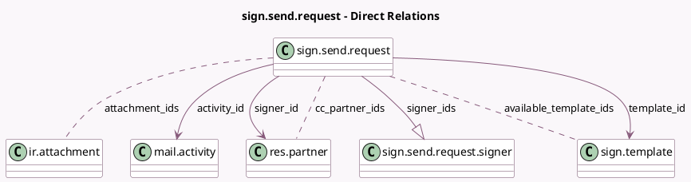

<!-- GENERATED:MODEL -->
---
tags: [odoo, enterprise, generated, model]
---

# sign.send.request

- Module: [[docs/Enterprise Addons/sign/sign|sign]]
- Scope: Enterprise Addons
- Defined in module: yes
- Source files: `wizard/sign_send_request.py`
- Python classes: `SignSendRequest`
- Description: Sign send request

## Field footprint

- Detected fields: 25
- Field types: `Boolean` x 7, `Char` x 4, `Date` x 1, `Html` x 2, `Integer` x 2, `Many2many` x 3, `Many2one` x 3, `One2many` x 1, `Reference` x 1, `Text` x 1
- Relation fields: 7

## Sample fields

- `activity_id`: `Many2one` (comodel `mail.activity`)
- `attachment_ids`: `Many2many` (comodel `ir.attachment`)
- `available_template_ids`: `Many2many` (comodel `sign.template`, compute `_compute_available_template_ids`)
- `body`: `Html` (comodel `body`, compute `_compute_mail_message_body`, store `True`)
- `cc_partner_ids`: `Many2many` (comodel `res.partner`)
- `certificate_reference`: `Boolean`
- `display_download_button`: `Boolean` (compute `_compute_display_download_button`, store `False`)
- `filename`: `Char` (comodel `Filename`, compute `_compute_filename`, store `True`)
- `has_default_template`: `Boolean`
- `is_user_signer`: `Boolean` (compute `_compute_is_user_signer`)
- `message_cc`: `Html` (comodel `CC Message`)
- `model`: `Char` (comodel `Related Document Model`)
- `only_autofill_readonly`: `Boolean` (compute `_compute_only_autofill_readonly`)
- `reference_doc`: `Reference`
- `reminder`: `Integer`
- `reminder_enabled`: `Boolean`
- `res_ids`: `Text` (comodel `Related Document IDs`)
- `scheduled_date`: `Char` (comodel `Scheduled Date`)
- `set_sign_order`: `Boolean`
- `signer_id`: `Many2one` (comodel `res.partner`)

## Method hints

- Detected methods: 23
- Action methods: none
- Compute methods: `_compute_available_template_ids`, `_compute_display_download_button`, `_compute_display_name`, `_compute_filename`, `_compute_is_user_signer`, `_compute_mail_message_body`, `_compute_only_autofill_readonly`, `_compute_signer_ids`, and 3 more
- Onchange methods: `_onchange_reminder`

## Direct relation diagram

## Navigation

- **Parent:** [[docs/Enterprise Addons/sign/Models]]

<!-- GENERATED:MODEL -->
