<!-- GENERATED:MODEL -->
---
tags: [odoo, enterprise, generated, model]
---

# sign.send.request.signer

- Module: [[docs/Enterprise Addons/sign/sign|sign]]
- Scope: Enterprise Addons
- Defined in module: yes
- Source files: `wizard/sign_send_request_signer.py`
- Python classes: `SignSendRequestSigner`
- Description: Sign send request signer

## Field footprint

- Detected fields: 4
- Field types: `Integer` x 1, `Many2one` x 3
- Relation fields: 3

## Sample fields

- `mail_sent_order`: `Integer`
- `partner_id`: `Many2one` (comodel `res.partner`)
- `role_id`: `Many2one` (comodel `sign.item.role`)
- `sign_send_request_id`: `Many2one` (comodel `sign.send.request`)

## Method hints

- Detected methods: 0
- Action methods: none
- Compute methods: none
- Onchange methods: none

## Direct relation diagram

```plantuml
@startuml
!define ODOO_COLOR_PRIMARY #714B67
!define ODOO_COLOR_ACCENT #875A7B
!define ODOO_COLOR_BG #FAF7FA

skinparam backgroundColor ODOO_COLOR_BG
skinparam defaultTextAlignment left
skinparam ArrowColor ODOO_COLOR_ACCENT
skinparam ClassBackgroundColor white
skinparam ClassBorderColor ODOO_COLOR_PRIMARY
skinparam ComponentBackgroundColor white
skinparam ComponentBorderColor ODOO_COLOR_PRIMARY
skinparam NoteBackgroundColor #FFF8FF
skinparam NoteBorderColor ODOO_COLOR_ACCENT
skinparam SequenceLifeLineBorderColor ODOO_COLOR_ACCENT
skinparam SequenceLifeLineBackgroundColor #FFFFFF
skinparam SequenceParticipantBorderColor ODOO_COLOR_PRIMARY
skinparam SequenceParticipantBackgroundColor #FFFFFF
skinparam sequence {
  ArrowColor ODOO_COLOR_ACCENT
  ActorBorderColor ODOO_COLOR_PRIMARY
}
title sign.send.request.signer - Direct Relations
class "sign.send.request.signer" as sign_send_request_signer
class "res.partner" as res_partner
class "sign.item.role" as sign_item_role
class "sign.send.request" as sign_send_request
sign_send_request_signer --> sign_item_role : role_id
sign_send_request_signer --> res_partner : partner_id
sign_send_request_signer --> sign_send_request : sign_send_request_id
@enduml
```

## Navigation

- **Parent:** [[docs/Enterprise Addons/sign/Models]]

<!-- GENERATED:MODEL -->
