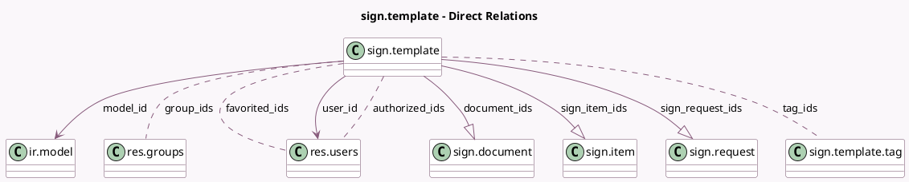

<!-- GENERATED:MODEL -->
---
tags: [odoo, enterprise, generated, model]
---

# sign.template

- Module: [[docs/Enterprise Addons/sign/sign|sign]]
- Scope: Enterprise Addons
- Defined in module: yes
- Source files: `models/sign_template.py`
- Python classes: `SignTemplate`
- Description: Signature Template

## Field footprint

- Detected fields: 22
- Field types: `Boolean` x 3, `Char` x 4, `Html` x 1, `Integer` x 5, `Many2many` x 4, `Many2one` x 2, `One2many` x 3
- Relation fields: 9

## Sample fields

- `active`: `Boolean`
- `authorized_ids`: `Many2many` (comodel `res.users`)
- `color`: `Integer`
- `document_ids`: `One2many` (comodel `sign.document`)
- `favorited_ids`: `Many2many` (comodel `res.users`)
- `group_ids`: `Many2many` (comodel `res.groups`)
- `has_sign_requests`: `Boolean` (compute `_compute_has_sign_requests`, store `True`)
- `in_progress_count`: `Integer` (compute `_compute_signed_in_progress_template`)
- `is_sharing`: `Boolean` (compute `_compute_is_sharing`)
- `message`: `Html` (comodel `Message`)
- `model_id`: `Many2one` (comodel `ir.model`)
- `model_name`: `Char` (related `model_id.model`)
- `name`: `Char`
- `redirect_url`: `Char`
- `redirect_url_text`: `Char`
- `responsible_count`: `Integer` (compute `_compute_responsible_count`)
- `sign_item_ids`: `One2many` (comodel `sign.item`, compute `_compute_sign_item_ids`, store `True`)
- `sign_request_ids`: `One2many` (comodel `sign.request`)
- `signature_request_validity`: `Integer`
- `signed_count`: `Integer` (compute `_compute_signed_in_progress_template`)

## Method hints

- Detected methods: 33
- Action methods: `action_duplicate`, `action_template_configuration`, `action_template_preview`
- Compute methods: `_compute_has_sign_requests`, `_compute_is_sharing`, `_compute_responsible_count`, `_compute_sign_item_ids`, `_compute_signed_in_progress_template`
- Onchange methods: none

## Direct relation diagram

## Navigation

- **Parent:** [[docs/Enterprise Addons/sign/Models]]

<!-- GENERATED:MODEL -->
