<!-- GENERATED:MODEL -->
---
tags: [odoo, enterprise, generated, model]
---

# sign.template.preview

- Module: [[docs/Enterprise Addons/sign/sign|sign]]
- Scope: Enterprise Addons
- Defined in module: yes
- Source files: `wizard/sign_template_preview.py`
- Python classes: `SignTemplatePreview`
- Description: Sign Tempate Preview

## Field footprint

- Detected fields: 3
- Field types: `Binary` x 1, `Many2one` x 2
- Relation fields: 2

## Sample fields

- `document_id`: `Many2one` (comodel `sign.document`)
- `pdf_data`: `Binary` (compute `_compute_pdf`)
- `template_id`: `Many2one` (comodel `sign.template`)

## Method hints

- Detected methods: 1
- Action methods: none
- Compute methods: `_compute_pdf`
- Onchange methods: none

## Direct relation diagram

```plantuml
@startuml
!define ODOO_COLOR_PRIMARY #714B67
!define ODOO_COLOR_ACCENT #875A7B
!define ODOO_COLOR_BG #FAF7FA

skinparam backgroundColor ODOO_COLOR_BG
skinparam defaultTextAlignment left
skinparam ArrowColor ODOO_COLOR_ACCENT
skinparam ClassBackgroundColor white
skinparam ClassBorderColor ODOO_COLOR_PRIMARY
skinparam ComponentBackgroundColor white
skinparam ComponentBorderColor ODOO_COLOR_PRIMARY
skinparam NoteBackgroundColor #FFF8FF
skinparam NoteBorderColor ODOO_COLOR_ACCENT
skinparam SequenceLifeLineBorderColor ODOO_COLOR_ACCENT
skinparam SequenceLifeLineBackgroundColor #FFFFFF
skinparam SequenceParticipantBorderColor ODOO_COLOR_PRIMARY
skinparam SequenceParticipantBackgroundColor #FFFFFF
skinparam sequence {
  ArrowColor ODOO_COLOR_ACCENT
  ActorBorderColor ODOO_COLOR_PRIMARY
}
title sign.template.preview - Direct Relations
class "sign.template.preview" as sign_template_preview
class "sign.document" as sign_document
class "sign.template" as sign_template
sign_template_preview --> sign_template : template_id
sign_template_preview --> sign_document : document_id
@enduml
```

## Navigation

- **Parent:** [[docs/Enterprise Addons/sign/Models]]

<!-- GENERATED:MODEL -->
