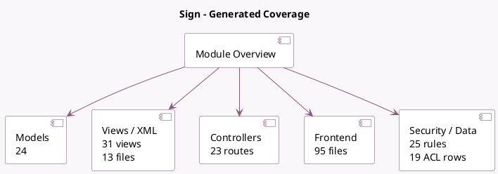

<!-- GENERATED:MODULE -->
---
tags: [odoo, enterprise, module]
---

# Sign

- Scope: Enterprise Addons
- Source: enterprise/sign
- Dependencies: [[docs/Community Addons/mail/mail|mail]], [[docs/Community Addons/attachment_indexation/attachment_indexation|attachment_indexation]], [[docs/Community Addons/portal/portal|portal]], [[docs/Community Addons/sms/sms|sms]], [[docs/Community Addons/certificate/certificate|certificate]]

## Summary

Send and request electronic signatures.

## Generated coverage

- Models: 24
- XML files with UI/data artifacts: 13
- Views: 31
- Actions: 13
- Menus: 11
- Rules (ir.rule): 25
- Access CSV entries: 19
- Controller units: 3
- Frontend asset files: 95

## Module map

## Detail notes

- Models: [[docs/Enterprise Addons/sign/Models|Models]] (24)
- Views and XML: [[docs/Enterprise Addons/sign/Views|Views]] (13 files)
- Controllers: [[docs/Enterprise Addons/sign/Controllers|Controllers]] (3)
- Frontend: [[docs/Enterprise Addons/sign/Frontend|Frontend]] (95 files)

## Key models

- `ir.http`
- `mail.activity.type`
- `report.sign.green_savings_report`
- `res.company`
- `res.config.settings`
- `res.partner`
- `res.users`
- `sign.completed.document`
- `sign.document`
- `sign.item`
- `sign.item.option`
- `sign.item.radio.set`

## Navigation

- [[../Enterprise Addons/Enterprise Addons|Back to scope]]
- [[../../docs/docs|Back to docs]]

<!-- GENERATED:MODULE -->

