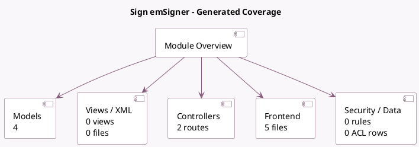

<!-- GENERATED:MODULE -->
---
tags: [odoo, enterprise, module]
---

# Sign emSigner

- Scope: Enterprise Addons
- Source: enterprise/sign_emsigner
- Dependencies: [[docs/Enterprise Addons/sign/sign|sign]], [[docs/Community Addons/iap/iap|iap]]

## Summary

Sign documents with emSigner

## Generated coverage

- Models: 4
- XML files with UI/data artifacts: 0
- Views: 0
- Actions: 0
- Menus: 0
- Rules (ir.rule): 0
- Access CSV entries: 0
- Controller units: 1
- Frontend asset files: 5

## Module map

## Detail notes

- Models: [[docs/Enterprise Addons/sign_emsigner/Models|Models]] (4)
- Controllers: [[docs/Enterprise Addons/sign_emsigner/Controllers|Controllers]] (1)
- Frontend: [[docs/Enterprise Addons/sign_emsigner/Frontend|Frontend]] (5 files)

## Key models

- `sign.item.role`
- `sign.request`
- `sign.request.item`
- `sign.send.request`

## Navigation

- [[../Enterprise Addons/Enterprise Addons|Back to scope]]
- [[../../docs/docs|Back to docs]]

<!-- GENERATED:MODULE -->

