<!-- GENERATED:MODEL -->
---
tags: [odoo, enterprise, generated, model]
---

# social.account

- Module: [[docs/Enterprise Addons/social/social|social]]
- Scope: Enterprise Addons
- Defined in module: yes
- Source files: `models/social_account.py`
- Python classes: `SocialAccount`
- Description: Social Account

## Field footprint

- Detected fields: 18
- Field types: `Boolean` x 4, `Char` x 3, `Float` x 3, `Image` x 1, `Integer` x 3, `Many2one` x 3, `Selection` x 1
- Relation fields: 3

## Sample fields

- `active`: `Boolean` (comodel `Active`)
- `audience`: `Integer` (comodel `Audience`)
- `audience_trend`: `Float` (comodel `Audience Trend`)
- `company_id`: `Many2one` (comodel `res.company`)
- `engagement`: `Integer` (comodel `Engagement`)
- `engagement_trend`: `Float` (comodel `Engagement Trend`)
- `has_account_stats`: `Boolean` (comodel `Has Account Stats`)
- `has_trends`: `Boolean` (comodel `Has Trends?`)
- `image`: `Image` (comodel `Image`)
- `is_media_disconnected`: `Boolean` (comodel `Link with external Social Media is broken`)
- `media_id`: `Many2one` (comodel `social.media`)
- `media_type`: `Selection` (related `media_id.media_type`)
- `name`: `Char` (comodel `Name`)
- `social_account_handle`: `Char` (comodel `Handle / Short Name`)
- `stats_link`: `Char` (comodel `Stats Link`, compute `_compute_stats_link`)
- `stories`: `Integer` (comodel `Stories`)
- `stories_trend`: `Float` (comodel `Stories Trend`)
- `utm_medium_id`: `Many2one` (comodel `utm.medium`)

## Method hints

- Detected methods: 11
- Action methods: none
- Compute methods: `_compute_display_name`, `_compute_statistics`, `_compute_stats_link`, `_compute_trend`
- Onchange methods: none

## Direct relation diagram

```plantuml
@startuml
!define ODOO_COLOR_PRIMARY #714B67
!define ODOO_COLOR_ACCENT #875A7B
!define ODOO_COLOR_BG #FAF7FA

skinparam backgroundColor ODOO_COLOR_BG
skinparam defaultTextAlignment left
skinparam ArrowColor ODOO_COLOR_ACCENT
skinparam ClassBackgroundColor white
skinparam ClassBorderColor ODOO_COLOR_PRIMARY
skinparam ComponentBackgroundColor white
skinparam ComponentBorderColor ODOO_COLOR_PRIMARY
skinparam NoteBackgroundColor #FFF8FF
skinparam NoteBorderColor ODOO_COLOR_ACCENT
skinparam SequenceLifeLineBorderColor ODOO_COLOR_ACCENT
skinparam SequenceLifeLineBackgroundColor #FFFFFF
skinparam SequenceParticipantBorderColor ODOO_COLOR_PRIMARY
skinparam SequenceParticipantBackgroundColor #FFFFFF
skinparam sequence {
  ArrowColor ODOO_COLOR_ACCENT
  ActorBorderColor ODOO_COLOR_PRIMARY
}
title social.account - Direct Relations
class "social.account" as social_account
class "res.company" as res_company
class "social.media" as social_media
class "utm.medium" as utm_medium
social_account --> social_media : media_id
social_account --> utm_medium : utm_medium_id
social_account --> res_company : company_id
@enduml
```

## Navigation

- **Parent:** [[docs/Enterprise Addons/social/Models]]

<!-- GENERATED:MODEL -->
