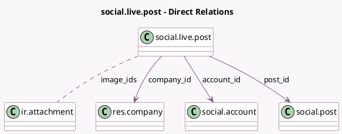

<!-- GENERATED:MODEL -->
---
tags: [odoo, enterprise, generated, model]
---

# social.live.post

- Module: [[docs/Enterprise Addons/social/social|social]]
- Scope: Enterprise Addons
- Defined in module: yes
- Source files: `models/social_live_post.py`
- Python classes: `SocialLivePost`
- Description: Social Live Post

## Field footprint

- Detected fields: 10
- Field types: `Char` x 2, `Integer` x 1, `Many2many` x 1, `Many2one` x 3, `Selection` x 2, `Text` x 1
- Relation fields: 4

## Sample fields

- `account_id`: `Many2one` (comodel `social.account`)
- `company_id`: `Many2one` (comodel `res.company`, related `account_id.company_id`)
- `engagement`: `Integer` (comodel `Engagement`)
- `failure_reason`: `Text` (comodel `Failure Reason`)
- `image_ids`: `Many2many` (comodel `ir.attachment`, compute `_compute_image_ids`)
- `live_post_link`: `Char` (comodel `Post Link`, compute `_compute_live_post_link`)
- `media_type`: `Selection` (related `account_id.media_type`)
- `message`: `Char` (comodel `Message`, compute `_compute_message`)
- `post_id`: `Many2one` (comodel `social.post`)
- `state`: `Selection`

## Method hints

- Detected methods: 12
- Action methods: `action_retry_post`
- Compute methods: `_compute_display_name`, `_compute_image_ids`, `_compute_live_post_link`, `_compute_message`
- Onchange methods: none

## Direct relation diagram

## Navigation

- **Parent:** [[docs/Enterprise Addons/social/Models]]

<!-- GENERATED:MODEL -->
