<!-- GENERATED:MODEL -->
---
tags: [odoo, enterprise, generated, model]
---

# social.media

- Module: [[docs/Enterprise Addons/social/social|social]]
- Scope: Enterprise Addons
- Defined in module: yes
- Source files: `models/social_media.py`
- Python classes: `SocialMedia`
- Description: Social Media
- Inherits: `mail.thread`

## Field footprint

- Detected fields: 11
- Field types: `Binary` x 1, `Boolean` x 2, `Char` x 3, `Integer` x 2, `One2many` x 2, `Selection` x 1
- Relation fields: 2

## Sample fields

- `account_ids`: `One2many` (comodel `social.account`)
- `accounts_count`: `Integer` (comodel `# Accounts`, compute `_compute_accounts_count`)
- `can_link_accounts`: `Boolean` (comodel `Can link accounts?`)
- `csrf_token`: `Char` (comodel `CSRF Token`, compute `_compute_csrf_token`)
- `has_streams`: `Boolean` (comodel `Streams Enabled`)
- `image`: `Binary` (comodel `Image`)
- `max_post_length`: `Integer` (comodel `Max Post Length`)
- `media_description`: `Char` (comodel `Description`)
- `media_type`: `Selection`
- `name`: `Char` (comodel `Name`)
- `stream_type_ids`: `One2many` (comodel `social.stream.type`)

## Method hints

- Detected methods: 4
- Action methods: `action_add_account`
- Compute methods: `_compute_accounts_count`, `_compute_csrf_token`
- Onchange methods: none

## Direct relation diagram

```plantuml
@startuml
!define ODOO_COLOR_PRIMARY #714B67
!define ODOO_COLOR_ACCENT #875A7B
!define ODOO_COLOR_BG #FAF7FA

skinparam backgroundColor ODOO_COLOR_BG
skinparam defaultTextAlignment left
skinparam ArrowColor ODOO_COLOR_ACCENT
skinparam ClassBackgroundColor white
skinparam ClassBorderColor ODOO_COLOR_PRIMARY
skinparam ComponentBackgroundColor white
skinparam ComponentBorderColor ODOO_COLOR_PRIMARY
skinparam NoteBackgroundColor #FFF8FF
skinparam NoteBorderColor ODOO_COLOR_ACCENT
skinparam SequenceLifeLineBorderColor ODOO_COLOR_ACCENT
skinparam SequenceLifeLineBackgroundColor #FFFFFF
skinparam SequenceParticipantBorderColor ODOO_COLOR_PRIMARY
skinparam SequenceParticipantBackgroundColor #FFFFFF
skinparam sequence {
  ArrowColor ODOO_COLOR_ACCENT
  ActorBorderColor ODOO_COLOR_PRIMARY
}
title social.media - Direct Relations
class "social.media" as social_media
class "social.account" as social_account
class "social.stream.type" as social_stream_type
social_media --|> social_account : account_ids
social_media --|> social_stream_type : stream_type_ids
@enduml
```

## Navigation

- **Parent:** [[docs/Enterprise Addons/social/Models]]

<!-- GENERATED:MODEL -->
