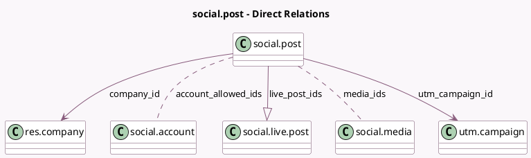

<!-- GENERATED:MODEL -->
---
tags: [odoo, enterprise, generated, model]
---

# social.post

- Module: [[docs/Enterprise Addons/social/social|social]]
- Scope: Enterprise Addons
- Defined in module: yes
- Source files: `models/social_post.py`
- Python classes: `SocialPost`
- Description: Social Post
- Inherits: `mail.activity.mixin`, `mail.thread`, `social.post.template`, `utm.source.mixin`

## Field footprint

- Detected fields: 18
- Field types: `Boolean` x 2, `Char` x 1, `Datetime` x 3, `Integer` x 3, `Many2many` x 3, `Many2one` x 3, `One2many` x 1, `Selection` x 2
- Relation fields: 7

## Sample fields

- `account_allowed_ids`: `Many2many` (comodel `social.account`, compute `_compute_account_allowed_ids`)
- `account_ids`: `Many2many`
- `calendar_date`: `Datetime` (comodel `Calendar Date`, compute `_compute_calendar_date`, store `True`)
- `click_count`: `Integer` (comodel `Number of clicks`, compute `_compute_click_count`)
- `company_id`: `Many2one` (comodel `res.company`)
- `engagement`: `Integer` (comodel `Engagement`, compute `_compute_post_engagement`)
- `has_post_errors`: `Boolean` (comodel `There are post errors on sub-posts`, compute `_compute_has_post_errors`)
- `is_hatched`: `Boolean` (compute `_compute_is_hatched`)
- `live_post_ids`: `One2many` (comodel `social.live.post`)
- `live_posts_by_media`: `Char` (comodel `Live Posts by Social Media`, compute `_compute_live_posts_by_media`)
- `media_ids`: `Many2many` (comodel `social.media`, compute `_compute_media_ids`, store `True`)
- `post_method`: `Selection`
- `published_date`: `Datetime` (comodel `Published Date`)
- `scheduled_date`: `Datetime` (comodel `Scheduled Date`)
- `source_id`: `Many2one`
- `state`: `Selection`
- `stream_posts_count`: `Integer` (comodel `Feed Posts Count`, compute `_compute_stream_posts_count`)
- `utm_campaign_id`: `Many2one` (comodel `utm.campaign`)

## Method hints

- Detected methods: 32
- Action methods: `action_post`, `action_redirect_to_clicks`, `action_schedule`, `action_set_draft`
- Compute methods: `_compute_account_allowed_ids`, `_compute_account_ids`, `_compute_calendar_date`, `_compute_click_count`, `_compute_display_name`, `_compute_has_active_accounts`, `_compute_has_post_errors`, `_compute_is_hatched`, and 4 more
- Onchange methods: none

## Direct relation diagram

## Navigation

- **Parent:** [[docs/Enterprise Addons/social/Models]]

<!-- GENERATED:MODEL -->
