<!-- GENERATED:MODEL -->
---
tags: [odoo, enterprise, generated, model]
---

# social.post.template

- Module: [[docs/Enterprise Addons/social/social|social]]
- Scope: Enterprise Addons
- Defined in module: yes
- Source files: `models/social_post_template.py`
- Python classes: `SocialPostTemplate`
- Description: Social Post Template

## Field footprint

- Detected fields: 8
- Field types: `Boolean` x 2, `Char` x 1, `Integer` x 1, `Many2many` x 2, `Text` x 2
- Relation fields: 2

## Sample fields

- `account_ids`: `Many2many` (comodel `social.account`, compute `_compute_account_ids`, store `True`)
- `display_message`: `Char` (compute `_compute_display_message`)
- `has_active_accounts`: `Boolean` (comodel `Are Accounts Available?`, compute `_compute_has_active_accounts`)
- `image_ids`: `Many2many` (comodel `ir.attachment`)
- `image_urls`: `Text` (comodel `Images URLs`, compute `_compute_image_urls`)
- `is_split_per_media`: `Boolean` (comodel `Split Per Network`)
- `media_count`: `Integer` (comodel `Media Count`, compute `_compute_media_count`)
- `message`: `Text` (comodel `Message`)

## Method hints

- Detected methods: 24
- Action methods: `action_generate_post`
- Compute methods: `_compute_account_ids`, `_compute_display_message`, `_compute_display_name`, `_compute_has_active_accounts`, `_compute_image_urls`, `_compute_images_by_media`, `_compute_media_count`, `_compute_message_by_media`
- Onchange methods: none

## Direct relation diagram

```plantuml
@startuml
!define ODOO_COLOR_PRIMARY #714B67
!define ODOO_COLOR_ACCENT #875A7B
!define ODOO_COLOR_BG #FAF7FA

skinparam backgroundColor ODOO_COLOR_BG
skinparam defaultTextAlignment left
skinparam ArrowColor ODOO_COLOR_ACCENT
skinparam ClassBackgroundColor white
skinparam ClassBorderColor ODOO_COLOR_PRIMARY
skinparam ComponentBackgroundColor white
skinparam ComponentBorderColor ODOO_COLOR_PRIMARY
skinparam NoteBackgroundColor #FFF8FF
skinparam NoteBorderColor ODOO_COLOR_ACCENT
skinparam SequenceLifeLineBorderColor ODOO_COLOR_ACCENT
skinparam SequenceLifeLineBackgroundColor #FFFFFF
skinparam SequenceParticipantBorderColor ODOO_COLOR_PRIMARY
skinparam SequenceParticipantBackgroundColor #FFFFFF
skinparam sequence {
  ArrowColor ODOO_COLOR_ACCENT
  ActorBorderColor ODOO_COLOR_PRIMARY
}
title social.post.template - Direct Relations
class "social.post.template" as social_post_template
class "ir.attachment" as ir_attachment
class "social.account" as social_account
social_post_template .. ir_attachment : image_ids
social_post_template .. social_account : account_ids
@enduml
```

## Navigation

- **Parent:** [[docs/Enterprise Addons/social/Models]]

<!-- GENERATED:MODEL -->
