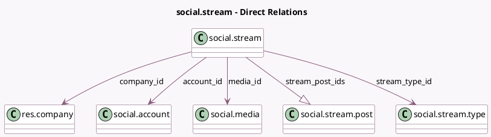

<!-- GENERATED:MODEL -->
---
tags: [odoo, enterprise, generated, model]
---

# social.stream

- Module: [[docs/Enterprise Addons/social/social|social]]
- Scope: Enterprise Addons
- Defined in module: yes
- Source files: `models/social_stream.py`
- Python classes: `SocialStream`
- Description: Social Stream

## Field footprint

- Detected fields: 9
- Field types: `Binary` x 1, `Char` x 2, `Integer` x 1, `Many2one` x 4, `One2many` x 1
- Relation fields: 5

## Sample fields

- `account_id`: `Many2one` (comodel `social.account`)
- `company_id`: `Many2one` (comodel `res.company`, related `account_id.company_id`, store `True`)
- `media_id`: `Many2one` (comodel `social.media`)
- `media_image`: `Binary` (related `media_id.image`)
- `name`: `Char` (comodel `Title`)
- `sequence`: `Integer` (comodel `Sequence`)
- `stream_post_ids`: `One2many` (comodel `social.stream.post`)
- `stream_type_id`: `Many2one` (comodel `social.stream.type`)
- `stream_type_type`: `Char` (related `stream_type_id.stream_type`)

## Method hints

- Detected methods: 5
- Action methods: none
- Compute methods: none
- Onchange methods: `_onchange_media_id`

## Direct relation diagram

## Navigation

- **Parent:** [[docs/Enterprise Addons/social/Models]]

<!-- GENERATED:MODEL -->
