<!-- GENERATED:MODEL -->
---
tags: [odoo, enterprise, generated, model]
---

# social.stream.post

- Module: [[docs/Enterprise Addons/social/social|social]]
- Scope: Enterprise Addons
- Defined in module: yes
- Source files: `models/social_stream_post.py`
- Python classes: `SocialStreamPost`
- Description: Social Stream Post

## Field footprint

- Detected fields: 17
- Field types: `Boolean` x 1, `Char` x 6, `Datetime` x 1, `Many2one` x 3, `One2many` x 1, `Selection` x 1, `Text` x 4
- Relation fields: 4

## Sample fields

- `account_id`: `Many2one` (related `stream_id.account_id`)
- `author_link`: `Char` (comodel `Author Link`, compute `_compute_author_link`)
- `author_name`: `Char` (comodel `Author Name`)
- `company_id`: `Many2one` (comodel `res.company`, related `account_id.company_id`)
- `formatted_published_date`: `Char` (comodel `Formatted Published Date`, compute `_compute_formatted_published_date`)
- `is_author`: `Boolean` (comodel `Is Author`, compute `_compute_is_author`)
- `link_description`: `Text` (comodel `Link Description`)
- `link_image_url`: `Char` (comodel `Link Image URL`)
- `link_title`: `Text` (comodel `Link Title`)
- `link_url`: `Char` (comodel `Link URL`)
- `media_type`: `Selection` (related `stream_id.media_id.media_type`)
- `message`: `Text` (comodel `Message`)
- `post_link`: `Char` (comodel `Post Link`, compute `_compute_post_link`)
- `published_date`: `Datetime` (comodel `Published date`)
- `stream_id`: `Many2one` (comodel `social.stream`)
- `stream_post_image_ids`: `One2many` (comodel `social.stream.post.image`)
- `stream_post_image_urls`: `Text` (comodel `Stream Post Images URLs`, compute `_compute_stream_post_image_urls`)

## Method hints

- Detected methods: 8
- Action methods: none
- Compute methods: `_compute_author_link`, `_compute_formatted_published_date`, `_compute_is_author`, `_compute_post_link`, `_compute_stream_post_image_urls`
- Onchange methods: none

## Direct relation diagram

```plantuml
@startuml
!define ODOO_COLOR_PRIMARY #714B67
!define ODOO_COLOR_ACCENT #875A7B
!define ODOO_COLOR_BG #FAF7FA

skinparam backgroundColor ODOO_COLOR_BG
skinparam defaultTextAlignment left
skinparam ArrowColor ODOO_COLOR_ACCENT
skinparam ClassBackgroundColor white
skinparam ClassBorderColor ODOO_COLOR_PRIMARY
skinparam ComponentBackgroundColor white
skinparam ComponentBorderColor ODOO_COLOR_PRIMARY
skinparam NoteBackgroundColor #FFF8FF
skinparam NoteBorderColor ODOO_COLOR_ACCENT
skinparam SequenceLifeLineBorderColor ODOO_COLOR_ACCENT
skinparam SequenceLifeLineBackgroundColor #FFFFFF
skinparam SequenceParticipantBorderColor ODOO_COLOR_PRIMARY
skinparam SequenceParticipantBackgroundColor #FFFFFF
skinparam sequence {
  ArrowColor ODOO_COLOR_ACCENT
  ActorBorderColor ODOO_COLOR_PRIMARY
}
title social.stream.post - Direct Relations
class "social.stream.post" as social_stream_post
class "res.company" as res_company
class "social.stream" as social_stream
class "social.stream.post.image" as social_stream_post_image
social_stream_post --> social_stream : stream_id
social_stream_post --> res_company : company_id
social_stream_post --|> social_stream_post_image : stream_post_image_ids
@enduml
```

## Navigation

- **Parent:** [[docs/Enterprise Addons/social/Models]]

<!-- GENERATED:MODEL -->
