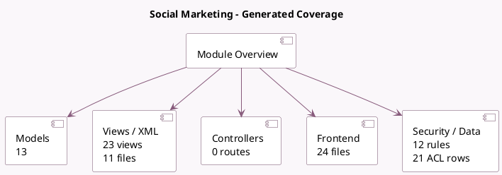

<!-- GENERATED:MODULE -->
---
tags: [odoo, enterprise, module]
---

# Social Marketing

- Scope: Enterprise Addons
- Source: enterprise/social
- Dependencies: [[docs/Community Addons/web/web|web]], [[docs/Community Addons/mail/mail|mail]], [[docs/Community Addons/iap/iap|iap]], [[docs/Community Addons/link_tracker/link_tracker|link_tracker]]

## Summary

Manage your social media and website visitors

## Generated coverage

- Models: 13
- XML files with UI/data artifacts: 11
- Views: 23
- Actions: 8
- Menus: 15
- Rules (ir.rule): 12
- Access CSV entries: 21
- Controller units: 0
- Frontend asset files: 24

## Module map

## Detail notes

- Models: [[docs/Enterprise Addons/social/Models|Models]] (13)
- Views and XML: [[docs/Enterprise Addons/social/Views|Views]] (11 files)
- Frontend: [[docs/Enterprise Addons/social/Frontend|Frontend]] (24 files)

## Key models

- `res.config.settings`
- `social.account`
- `social.live.post`
- `social.media`
- `social.post`
- `social.post.template`
- `social.stream`
- `social.stream.post`
- `social.stream.post.image`
- `social.stream.type`
- `utm.campaign`
- `utm.medium`

## Navigation

- [[../Enterprise Addons/Enterprise Addons|Back to scope]]
- [[../../docs/docs|Back to docs]]

<!-- GENERATED:MODULE -->

