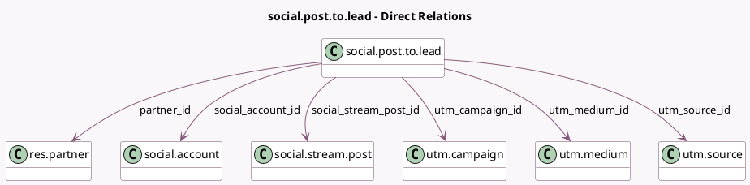

<!-- GENERATED:MODEL -->
---
tags: [odoo, enterprise, generated, model]
---

# social.post.to.lead

- Module: [[docs/Enterprise Addons/social_crm/social_crm|social_crm]]
- Scope: Enterprise Addons
- Defined in module: yes
- Source files: `wizard/social_post_to_lead.py`
- Python classes: `SocialPostToLead`
- Description: Convert Social Post to Lead

## Field footprint

- Detected fields: 13
- Field types: `Char` x 2, `Datetime` x 1, `Html` x 1, `Many2one` x 6, `Selection` x 2, `Text` x 1
- Relation fields: 6

## Sample fields

- `action`: `Selection` (compute `_compute_partner_action_data`, store `True`)
- `author_name`: `Char` (comodel `Post Author Name`, compute `_compute_post_data`, store `True`)
- `conversion_source`: `Selection`
- `partner_id`: `Many2one` (comodel `res.partner`, compute `_compute_partner_action_data`, store `True`)
- `post_content`: `Html` (comodel `Post Content`)
- `post_datetime`: `Datetime` (comodel `Post Datetime`, compute `_compute_post_data`, store `True`)
- `post_image_urls`: `Text` (comodel `Post Images URLs`)
- `post_link`: `Char` (comodel `Post Link`, compute `_compute_post_data`, store `True`)
- `social_account_id`: `Many2one` (comodel `social.account`)
- `social_stream_post_id`: `Many2one` (comodel `social.stream.post`)
- `utm_campaign_id`: `Many2one` (comodel `utm.campaign`, compute `_compute_utm_data`)
- `utm_medium_id`: `Many2one` (comodel `utm.medium`, compute `_compute_utm_data`)
- `utm_source_id`: `Many2one` (comodel `utm.source`, compute `_compute_utm_data`)

## Method hints

- Detected methods: 4
- Action methods: `action_convert_to_lead`
- Compute methods: `_compute_partner_action_data`, `_compute_post_data`, `_compute_utm_data`
- Onchange methods: none

## Direct relation diagram

## Navigation

- **Parent:** [[docs/Enterprise Addons/social_crm/Models]]

<!-- GENERATED:MODEL -->
