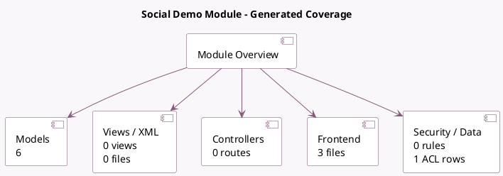

<!-- GENERATED:MODULE -->
---
tags: [odoo, enterprise, module]
---

# Social Demo Module

- Scope: Enterprise Addons
- Source: enterprise/social_demo
- Dependencies: [[docs/Enterprise Addons/social/social|social]], [[docs/Enterprise Addons/social_facebook/social_facebook|social_facebook]], [[docs/Enterprise Addons/social_twitter/social_twitter|social_twitter]], [[docs/Enterprise Addons/social_linkedin/social_linkedin|social_linkedin]], [[docs/Enterprise Addons/social_youtube/social_youtube|social_youtube]], [[docs/Enterprise Addons/social_instagram/social_instagram|social_instagram]], [[docs/Community Addons/product/product|product]]

## Summary

Get demo data for the social module

## Generated coverage

- Models: 6
- XML files with UI/data artifacts: 0
- Views: 0
- Actions: 0
- Menus: 0
- Rules (ir.rule): 0
- Access CSV entries: 1
- Controller units: 0
- Frontend asset files: 3

## Module map

## Detail notes

- Models: [[docs/Enterprise Addons/social_demo/Models|Models]] (6)
- Frontend: [[docs/Enterprise Addons/social_demo/Frontend|Frontend]] (3 files)

## Key models

- `social.account`
- `social.live.post`
- `social.post`
- `social.stream`
- `social.stream.post`
- `utm.campaign`

## Navigation

- [[../Enterprise Addons/Enterprise Addons|Back to scope]]
- [[../../docs/docs|Back to docs]]

<!-- GENERATED:MODULE -->

