<!-- GENERATED:MODEL -->
---
tags: [odoo, enterprise, generated, model]
---

# social.post.template

- Module: [[docs/Enterprise Addons/social_linkedin/social_linkedin|social_linkedin]]
- Scope: Enterprise Addons
- Defined in module: extension only
- Source files: `models/social_post_template.py`
- Python classes: `SocialPostTemplate`

## Field footprint

- Detected fields: 5
- Field types: `Boolean` x 2, `Html` x 1, `Many2many` x 1, `Text` x 1
- Relation fields: 1

## Sample fields

- `display_linkedin_preview`: `Boolean` (comodel `Display LinkedIn Preview`, compute `_compute_display_linkedin_preview`)
- `has_linkedin_account`: `Boolean` (comodel `Has LinkedIn Account`, compute `_compute_has_linkedin_account`)
- `linkedin_image_ids`: `Many2many` (comodel `ir.attachment`, compute `_compute_images_by_media`, store `True`)
- `linkedin_message`: `Text` (comodel `LinkedIn Message`, compute `_compute_message_by_media`, store `True`)
- `linkedin_preview`: `Html` (comodel `LinkedIn Preview`, compute `_compute_linkedin_preview`)

## Method hints

- Detected methods: 6
- Action methods: none
- Compute methods: `_compute_display_linkedin_preview`, `_compute_has_linkedin_account`, `_compute_linkedin_preview`
- Onchange methods: none

## Direct relation diagram

```plantuml
@startuml
!define ODOO_COLOR_PRIMARY #714B67
!define ODOO_COLOR_ACCENT #875A7B
!define ODOO_COLOR_BG #FAF7FA

skinparam backgroundColor ODOO_COLOR_BG
skinparam defaultTextAlignment left
skinparam ArrowColor ODOO_COLOR_ACCENT
skinparam ClassBackgroundColor white
skinparam ClassBorderColor ODOO_COLOR_PRIMARY
skinparam ComponentBackgroundColor white
skinparam ComponentBorderColor ODOO_COLOR_PRIMARY
skinparam NoteBackgroundColor #FFF8FF
skinparam NoteBorderColor ODOO_COLOR_ACCENT
skinparam SequenceLifeLineBorderColor ODOO_COLOR_ACCENT
skinparam SequenceLifeLineBackgroundColor #FFFFFF
skinparam SequenceParticipantBorderColor ODOO_COLOR_PRIMARY
skinparam SequenceParticipantBackgroundColor #FFFFFF
skinparam sequence {
  ArrowColor ODOO_COLOR_ACCENT
  ActorBorderColor ODOO_COLOR_PRIMARY
}
title social.post.template - Direct Relations
class "social.post.template" as social_post_template
class "ir.attachment" as ir_attachment
social_post_template .. ir_attachment : linkedin_image_ids
@enduml
```

## Navigation

- **Parent:** [[docs/Enterprise Addons/social_linkedin/Models]]

<!-- GENERATED:MODEL -->
