<!-- GENERATED:MODEL -->
---
tags: [odoo, enterprise, generated, model]
---

# social.account

- Module: [[docs/Enterprise Addons/social_push_notifications/social_push_notifications|social_push_notifications]]
- Scope: Enterprise Addons
- Defined in module: extension only
- Source files: `models/social_account.py`
- Python classes: `SocialAccount`

## Field footprint

- Detected fields: 12
- Field types: `Binary` x 2, `Boolean` x 1, `Char` x 6, `Integer` x 1, `Many2one` x 1, `Text` x 1
- Relation fields: 1

## Sample fields

- `firebase_admin_key_file`: `Binary` (comodel `Firebase Admin Key File`, related `website_id.firebase_admin_key_file`)
- `firebase_project_id`: `Char` (comodel `Firebase Project ID`, related `website_id.firebase_project_id`)
- `firebase_push_certificate_key`: `Char` (comodel `Firebase Push Certificate Key`, related `website_id.firebase_push_certificate_key`)
- `firebase_sender_id`: `Char` (comodel `Firebase Sender ID`, related `website_id.firebase_sender_id`)
- `firebase_use_own_account`: `Boolean` (comodel `Use your own Firebase account`, related `website_id.firebase_use_own_account`)
- `firebase_web_api_key`: `Char` (comodel `Firebase Web API Key`, related `website_id.firebase_web_api_key`)
- `firebase_web_app_id`: `Char` (comodel `Firebase Web App ID`, related `website_id.firebase_web_app_id`)
- `notification_request_body`: `Text` (comodel `Notification Request Text`, related `website_id.notification_request_body`)
- `notification_request_delay`: `Integer` (comodel `Notification Request Delay (seconds)`, related `website_id.notification_request_delay`)
- `notification_request_icon`: `Binary` (comodel `Notification Request Icon`, related `website_id.notification_request_icon`)
- `notification_request_title`: `Char` (comodel `Notification Request Title`, related `website_id.notification_request_title`)
- `website_id`: `Many2one` (comodel `website`)

## Method hints

- Detected methods: 4
- Action methods: none
- Compute methods: none
- Onchange methods: none

## Direct relation diagram

```plantuml
@startuml
!define ODOO_COLOR_PRIMARY #714B67
!define ODOO_COLOR_ACCENT #875A7B
!define ODOO_COLOR_BG #FAF7FA

skinparam backgroundColor ODOO_COLOR_BG
skinparam defaultTextAlignment left
skinparam ArrowColor ODOO_COLOR_ACCENT
skinparam ClassBackgroundColor white
skinparam ClassBorderColor ODOO_COLOR_PRIMARY
skinparam ComponentBackgroundColor white
skinparam ComponentBorderColor ODOO_COLOR_PRIMARY
skinparam NoteBackgroundColor #FFF8FF
skinparam NoteBorderColor ODOO_COLOR_ACCENT
skinparam SequenceLifeLineBorderColor ODOO_COLOR_ACCENT
skinparam SequenceLifeLineBackgroundColor #FFFFFF
skinparam SequenceParticipantBorderColor ODOO_COLOR_PRIMARY
skinparam SequenceParticipantBackgroundColor #FFFFFF
skinparam sequence {
  ArrowColor ODOO_COLOR_ACCENT
  ActorBorderColor ODOO_COLOR_PRIMARY
}
title social.account - Direct Relations
class "social.account" as social_account
class "website" as website
social_account --> website : website_id
@enduml
```

## Navigation

- **Parent:** [[docs/Enterprise Addons/social_push_notifications/Models]]

<!-- GENERATED:MODEL -->
