<!-- GENERATED:MODEL -->
---
tags: [odoo, enterprise, generated, model]
---

# social.live.post

- Module: [[docs/Enterprise Addons/social_push_notifications/social_push_notifications|social_push_notifications]]
- Scope: Enterprise Addons
- Defined in module: extension only
- Source files: `models/social_live_post.py`
- Python classes: `SocialLivePost`

## Field footprint

- Detected fields: 4
- Field types: `Binary` x 1, `Char` x 2, `Many2many` x 1
- Relation fields: 1

## Sample fields

- `push_notification_image`: `Binary` (related `post_id.push_notification_image`)
- `push_notification_target_url`: `Char` (related `post_id.push_notification_target_url`)
- `push_notification_title`: `Char` (related `post_id.push_notification_title`)
- `reached_visitor_ids`: `Many2many` (comodel `website.visitor`)

## Method hints

- Detected methods: 3
- Action methods: none
- Compute methods: none
- Onchange methods: none

## Direct relation diagram

```plantuml
@startuml
!define ODOO_COLOR_PRIMARY #714B67
!define ODOO_COLOR_ACCENT #875A7B
!define ODOO_COLOR_BG #FAF7FA

skinparam backgroundColor ODOO_COLOR_BG
skinparam defaultTextAlignment left
skinparam ArrowColor ODOO_COLOR_ACCENT
skinparam ClassBackgroundColor white
skinparam ClassBorderColor ODOO_COLOR_PRIMARY
skinparam ComponentBackgroundColor white
skinparam ComponentBorderColor ODOO_COLOR_PRIMARY
skinparam NoteBackgroundColor #FFF8FF
skinparam NoteBorderColor ODOO_COLOR_ACCENT
skinparam SequenceLifeLineBorderColor ODOO_COLOR_ACCENT
skinparam SequenceLifeLineBackgroundColor #FFFFFF
skinparam SequenceParticipantBorderColor ODOO_COLOR_PRIMARY
skinparam SequenceParticipantBackgroundColor #FFFFFF
skinparam sequence {
  ArrowColor ODOO_COLOR_ACCENT
  ActorBorderColor ODOO_COLOR_PRIMARY
}
title social.live.post - Direct Relations
class "social.live.post" as social_live_post
class "website.visitor" as website_visitor
social_live_post .. website_visitor : reached_visitor_ids
@enduml
```

## Navigation

- **Parent:** [[docs/Enterprise Addons/social_push_notifications/Models]]

<!-- GENERATED:MODEL -->
