<!-- GENERATED:MODEL -->
---
tags: [odoo, enterprise, generated, model]
---

# utm.campaign

- Module: [[docs/Enterprise Addons/social_push_notifications/social_push_notifications|social_push_notifications]]
- Scope: Enterprise Addons
- Defined in module: extension only
- Source files: `models/utm.py`
- Python classes: `UtmCampaign`

## Field footprint

- Detected fields: 3
- Field types: `Integer` x 1, `One2many` x 2
- Relation fields: 2

## Sample fields

- `social_post_ids`: `One2many` (compute `_compute_social_post_ids`)
- `social_push_notification_ids`: `One2many` (comodel `social.post`, compute `_compute_social_post_ids`)
- `social_push_notifications_count`: `Integer` (compute `_compute_social_push_notifications_count`)

## Method hints

- Detected methods: 6
- Action methods: `action_redirect_to_push_notifications`, `action_send_push_notification`
- Compute methods: `_compute_social_post_ids`, `_compute_social_push_notifications_count`
- Onchange methods: none

## Direct relation diagram

```plantuml
@startuml
!define ODOO_COLOR_PRIMARY #714B67
!define ODOO_COLOR_ACCENT #875A7B
!define ODOO_COLOR_BG #FAF7FA

skinparam backgroundColor ODOO_COLOR_BG
skinparam defaultTextAlignment left
skinparam ArrowColor ODOO_COLOR_ACCENT
skinparam ClassBackgroundColor white
skinparam ClassBorderColor ODOO_COLOR_PRIMARY
skinparam ComponentBackgroundColor white
skinparam ComponentBorderColor ODOO_COLOR_PRIMARY
skinparam NoteBackgroundColor #FFF8FF
skinparam NoteBorderColor ODOO_COLOR_ACCENT
skinparam SequenceLifeLineBorderColor ODOO_COLOR_ACCENT
skinparam SequenceLifeLineBackgroundColor #FFFFFF
skinparam SequenceParticipantBorderColor ODOO_COLOR_PRIMARY
skinparam SequenceParticipantBackgroundColor #FFFFFF
skinparam sequence {
  ArrowColor ODOO_COLOR_ACCENT
  ActorBorderColor ODOO_COLOR_PRIMARY
}
title utm.campaign - Direct Relations
class "utm.campaign" as utm_campaign
class "social.post" as social_post
utm_campaign --|> social_post : social_push_notification_ids
@enduml
```

## Navigation

- **Parent:** [[docs/Enterprise Addons/social_push_notifications/Models]]

<!-- GENERATED:MODEL -->
