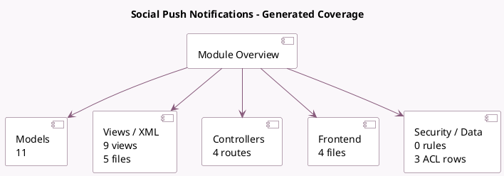

<!-- GENERATED:MODULE -->
---
tags: [odoo, enterprise, module]
---

# Social Push Notifications

- Scope: Enterprise Addons
- Source: enterprise/social_push_notifications
- Dependencies: [[docs/Enterprise Addons/social/social|social]], [[docs/Community Addons/website/website|website]]

## Summary

Send live notifications to your web visitors

## Generated coverage

- Models: 11
- XML files with UI/data artifacts: 5
- Views: 9
- Actions: 1
- Menus: 1
- Rules (ir.rule): 0
- Access CSV entries: 3
- Controller units: 1
- Frontend asset files: 4

## Module map

## Detail notes

- Models: [[docs/Enterprise Addons/social_push_notifications/Models|Models]] (11)
- Views and XML: [[docs/Enterprise Addons/social_push_notifications/Views|Views]] (5 files)
- Controllers: [[docs/Enterprise Addons/social_push_notifications/Controllers|Controllers]] (1)
- Frontend: [[docs/Enterprise Addons/social_push_notifications/Frontend|Frontend]] (4 files)

## Key models

- `ir.http`
- `res.config.settings`
- `social.account`
- `social.live.post`
- `social.media`
- `social.post`
- `social.post.template`
- `utm.campaign`
- `website`
- `website.visitor`
- `website.visitor.push.subscription`

## Navigation

- [[../Enterprise Addons/Enterprise Addons|Back to scope]]
- [[../../docs/docs|Back to docs]]

<!-- GENERATED:MODULE -->

