<!-- GENERATED:MODEL -->
---
tags: [odoo, enterprise, generated, model]
---

# social.stream

- Module: [[docs/Enterprise Addons/social_twitter/social_twitter|social_twitter]]
- Scope: Enterprise Addons
- Defined in module: extension only
- Source files: `models/social_stream.py`
- Python classes: `SocialStream`

## Field footprint

- Detected fields: 4
- Field types: `Char` x 3, `Many2one` x 1
- Relation fields: 1

## Sample fields

- `twitter_account_user_id`: `Char` (related `account_id.twitter_user_id`)
- `twitter_followed_account_id`: `Many2one` (comodel `social.twitter.account`)
- `twitter_followed_account_search`: `Char` (comodel `Search User`)
- `twitter_searched_keyword`: `Char` (comodel `Search Keyword`)

## Method hints

- Detected methods: 5
- Action methods: none
- Compute methods: none
- Onchange methods: none

## Direct relation diagram

```plantuml
@startuml
!define ODOO_COLOR_PRIMARY #714B67
!define ODOO_COLOR_ACCENT #875A7B
!define ODOO_COLOR_BG #FAF7FA

skinparam backgroundColor ODOO_COLOR_BG
skinparam defaultTextAlignment left
skinparam ArrowColor ODOO_COLOR_ACCENT
skinparam ClassBackgroundColor white
skinparam ClassBorderColor ODOO_COLOR_PRIMARY
skinparam ComponentBackgroundColor white
skinparam ComponentBorderColor ODOO_COLOR_PRIMARY
skinparam NoteBackgroundColor #FFF8FF
skinparam NoteBorderColor ODOO_COLOR_ACCENT
skinparam SequenceLifeLineBorderColor ODOO_COLOR_ACCENT
skinparam SequenceLifeLineBackgroundColor #FFFFFF
skinparam SequenceParticipantBorderColor ODOO_COLOR_PRIMARY
skinparam SequenceParticipantBackgroundColor #FFFFFF
skinparam sequence {
  ArrowColor ODOO_COLOR_ACCENT
  ActorBorderColor ODOO_COLOR_PRIMARY
}
title social.stream - Direct Relations
class "social.stream" as social_stream
class "social.twitter.account" as social_twitter_account
social_stream --> social_twitter_account : twitter_followed_account_id
@enduml
```

## Navigation

- **Parent:** [[docs/Enterprise Addons/social_twitter/Models]]

<!-- GENERATED:MODEL -->
