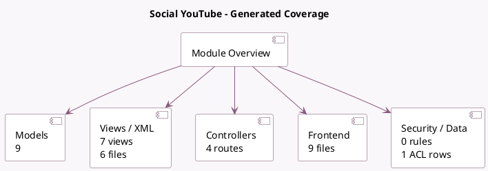

<!-- GENERATED:MODULE -->
---
tags: [odoo, enterprise, module]
---

# Social YouTube

- Scope: Enterprise Addons
- Source: enterprise/social_youtube
- Dependencies: [[docs/Enterprise Addons/social/social|social]], [[docs/Community Addons/iap/iap|iap]]

## Summary

Manage your YouTube videos and schedule video uploads

## Generated coverage

- Models: 9
- XML files with UI/data artifacts: 6
- Views: 7
- Actions: 1
- Menus: 0
- Rules (ir.rule): 0
- Access CSV entries: 1
- Controller units: 1
- Frontend asset files: 9

## Module map

## Detail notes

- Models: [[docs/Enterprise Addons/social_youtube/Models|Models]] (9)
- Views and XML: [[docs/Enterprise Addons/social_youtube/Views|Views]] (6 files)
- Controllers: [[docs/Enterprise Addons/social_youtube/Controllers|Controllers]] (1)
- Frontend: [[docs/Enterprise Addons/social_youtube/Frontend|Frontend]] (9 files)

## Key models

- `res.config.settings`
- `social.account`
- `social.account.revoke.youtube`
- `social.live.post`
- `social.media`
- `social.post`
- `social.post.template`
- `social.stream`
- `social.stream.post`

## Navigation

- [[../Enterprise Addons/Enterprise Addons|Back to scope]]
- [[../../docs/docs|Back to docs]]

<!-- GENERATED:MODULE -->

