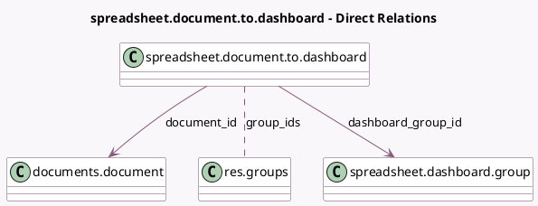

<!-- GENERATED:MODEL -->
---
tags: [odoo, enterprise, generated, model]
---

# spreadsheet.document.to.dashboard

- Module: [[docs/Enterprise Addons/spreadsheet_dashboard_documents/spreadsheet_dashboard_documents|spreadsheet_dashboard_documents]]
- Scope: Enterprise Addons
- Defined in module: yes
- Source files: `wizard/documents_to_dashboard.py`
- Python classes: `SpreadsheetDocumentToDashboard`
- Description: Create a dashboard from a spreadsheet document

## Field footprint

- Detected fields: 4
- Field types: `Char` x 1, `Many2many` x 1, `Many2one` x 2
- Relation fields: 3

## Sample fields

- `dashboard_group_id`: `Many2one` (comodel `spreadsheet.dashboard.group`)
- `document_id`: `Many2one` (comodel `documents.document`)
- `group_ids`: `Many2many` (comodel `res.groups`)
- `name`: `Char` (comodel `Dashboard Name`, compute `_compute_name`, store `True`)

## Method hints

- Detected methods: 3
- Action methods: none
- Compute methods: `_compute_name`
- Onchange methods: none

## Direct relation diagram

## Navigation

- **Parent:** [[docs/Enterprise Addons/spreadsheet_dashboard_documents/Models]]

<!-- GENERATED:MODEL -->
