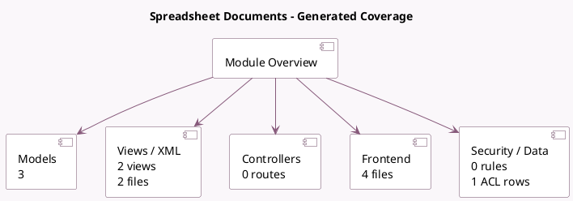

<!-- GENERATED:MODULE -->
---
tags: [odoo, enterprise, module]
---

# Spreadsheet Documents

- Scope: Enterprise Addons
- Source: enterprise/spreadsheet_dashboard_documents
- Dependencies: [[docs/Enterprise Addons/spreadsheet_dashboard_edition/spreadsheet_dashboard_edition|spreadsheet_dashboard_edition]], [[docs/Enterprise Addons/documents_spreadsheet/documents_spreadsheet|documents_spreadsheet]]

## Summary

Spreadsheet Documents

## Generated coverage

- Models: 3
- XML files with UI/data artifacts: 2
- Views: 2
- Actions: 0
- Menus: 0
- Rules (ir.rule): 0
- Access CSV entries: 1
- Controller units: 0
- Frontend asset files: 4

## Module map

## Detail notes

- Models: [[docs/Enterprise Addons/spreadsheet_dashboard_documents/Models|Models]] (3)
- Views and XML: [[docs/Enterprise Addons/spreadsheet_dashboard_documents/Views|Views]] (2 files)
- Frontend: [[docs/Enterprise Addons/spreadsheet_dashboard_documents/Frontend|Frontend]] (4 files)

## Key models

- `documents.document`
- `spreadsheet.dashboard`
- `spreadsheet.document.to.dashboard`

## Navigation

- [[../Enterprise Addons/Enterprise Addons|Back to scope]]
- [[../../docs/docs|Back to docs]]

<!-- GENERATED:MODULE -->

