<!-- GENERATED:MODEL -->
---
tags: [odoo, enterprise, generated, model]
---

# spreadsheet.mixin

- Module: [[docs/Enterprise Addons/spreadsheet_edition/spreadsheet_edition|spreadsheet_edition]]
- Scope: Enterprise Addons
- Defined in module: yes
- Source files: `models/spreadsheet_mixin.py`
- Python classes: `SpreadsheetMixin`
- Inherits: `bus.listener.mixin`

## Field footprint

- Detected fields: 4
- Field types: `Binary` x 2, `Char` x 1, `One2many` x 1
- Relation fields: 1

## Sample fields

- `current_revision_uuid`: `Char` (compute `_compute_current_revision_uuid`)
- `display_thumbnail`: `Binary` (compute `_compute_display_thumbnail`)
- `spreadsheet_revision_ids`: `One2many` (comodel `spreadsheet.revision`)
- `spreadsheet_snapshot`: `Binary`

## Method hints

- Detected methods: 44
- Action methods: `action_open_new_spreadsheet`, `action_open_spreadsheet`
- Compute methods: `_compute_current_revision_uuid`, `_compute_display_thumbnail`
- Onchange methods: none

## Direct relation diagram

```plantuml
@startuml
!define ODOO_COLOR_PRIMARY #714B67
!define ODOO_COLOR_ACCENT #875A7B
!define ODOO_COLOR_BG #FAF7FA

skinparam backgroundColor ODOO_COLOR_BG
skinparam defaultTextAlignment left
skinparam ArrowColor ODOO_COLOR_ACCENT
skinparam ClassBackgroundColor white
skinparam ClassBorderColor ODOO_COLOR_PRIMARY
skinparam ComponentBackgroundColor white
skinparam ComponentBorderColor ODOO_COLOR_PRIMARY
skinparam NoteBackgroundColor #FFF8FF
skinparam NoteBorderColor ODOO_COLOR_ACCENT
skinparam SequenceLifeLineBorderColor ODOO_COLOR_ACCENT
skinparam SequenceLifeLineBackgroundColor #FFFFFF
skinparam SequenceParticipantBorderColor ODOO_COLOR_PRIMARY
skinparam SequenceParticipantBackgroundColor #FFFFFF
skinparam sequence {
  ArrowColor ODOO_COLOR_ACCENT
  ActorBorderColor ODOO_COLOR_PRIMARY
}
title spreadsheet.mixin - Direct Relations
class "spreadsheet.mixin" as spreadsheet_mixin
class "spreadsheet.revision" as spreadsheet_revision
spreadsheet_mixin --|> spreadsheet_revision : spreadsheet_revision_ids
@enduml
```

## Navigation

- **Parent:** [[docs/Enterprise Addons/spreadsheet_edition/Models]]

<!-- GENERATED:MODEL -->
