<!-- GENERATED:MODEL -->
---
tags: [odoo, enterprise, generated, model]
---

# spreadsheet.revision

- Module: [[docs/Enterprise Addons/spreadsheet_edition/spreadsheet_edition|spreadsheet_edition]]
- Scope: Enterprise Addons
- Defined in module: yes
- Source files: `models/spreadsheet_revision.py`
- Python classes: `SpreadsheetRevision`
- Description: Collaborative spreadsheet revision

## Field footprint

- Detected fields: 9
- Field types: `Boolean` x 1, `Char` x 4, `Datetime` x 1, `Many2one` x 2, `Many2oneReference` x 1
- Relation fields: 2

## Sample fields

- `active`: `Boolean`
- `author_id`: `Many2one` (comodel `res.users`)
- `commands`: `Char`
- `name`: `Char` (comodel `Revision name`)
- `parent_revision_id`: `Many2one` (comodel `spreadsheet.revision`)
- `res_id`: `Many2oneReference`
- `res_model`: `Char`
- `revision_date`: `Datetime`
- `revision_uuid`: `Char`

## Method hints

- Detected methods: 2
- Action methods: none
- Compute methods: `_compute_display_name`
- Onchange methods: none

## Direct relation diagram

```plantuml
@startuml
!define ODOO_COLOR_PRIMARY #714B67
!define ODOO_COLOR_ACCENT #875A7B
!define ODOO_COLOR_BG #FAF7FA

skinparam backgroundColor ODOO_COLOR_BG
skinparam defaultTextAlignment left
skinparam ArrowColor ODOO_COLOR_ACCENT
skinparam ClassBackgroundColor white
skinparam ClassBorderColor ODOO_COLOR_PRIMARY
skinparam ComponentBackgroundColor white
skinparam ComponentBorderColor ODOO_COLOR_PRIMARY
skinparam NoteBackgroundColor #FFF8FF
skinparam NoteBorderColor ODOO_COLOR_ACCENT
skinparam SequenceLifeLineBorderColor ODOO_COLOR_ACCENT
skinparam SequenceLifeLineBackgroundColor #FFFFFF
skinparam SequenceParticipantBorderColor ODOO_COLOR_PRIMARY
skinparam SequenceParticipantBackgroundColor #FFFFFF
skinparam sequence {
  ArrowColor ODOO_COLOR_ACCENT
  ActorBorderColor ODOO_COLOR_PRIMARY
}
title spreadsheet.revision - Direct Relations
class "spreadsheet.revision" as spreadsheet_revision
class "res.users" as res_users
class "spreadsheet.revision" as spreadsheet_revision
spreadsheet_revision --> spreadsheet_revision : parent_revision_id
spreadsheet_revision --> res_users : author_id
@enduml
```

## Navigation

- **Parent:** [[docs/Enterprise Addons/spreadsheet_edition/Models]]

<!-- GENERATED:MODEL -->
