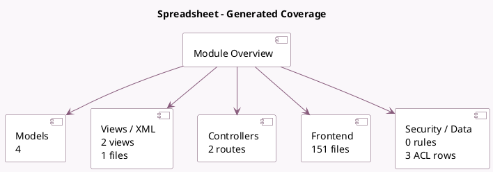

<!-- GENERATED:MODULE -->
---
tags: [odoo, enterprise, module]
---

# Spreadsheet

- Scope: Enterprise Addons
- Source: enterprise/spreadsheet_edition
- Dependencies: [[docs/Community Addons/spreadsheet/spreadsheet|spreadsheet]], [[docs/Community Addons/mail/mail|mail]], [[docs/Enterprise Addons/web_enterprise/web_enterprise|web_enterprise]]

## Summary

Spreadsheet

## Generated coverage

- Models: 4
- XML files with UI/data artifacts: 1
- Views: 2
- Actions: 1
- Menus: 2
- Rules (ir.rule): 0
- Access CSV entries: 3
- Controller units: 1
- Frontend asset files: 151

## Module map

## Detail notes

- Models: [[docs/Enterprise Addons/spreadsheet_edition/Models|Models]] (4)
- Views and XML: [[docs/Enterprise Addons/spreadsheet_edition/Views|Views]] (1 files)
- Controllers: [[docs/Enterprise Addons/spreadsheet_edition/Controllers|Controllers]] (1)
- Frontend: [[docs/Enterprise Addons/spreadsheet_edition/Frontend|Frontend]] (151 files)

## Key models

- `ir.websocket`
- `spreadsheet.cell.thread`
- `spreadsheet.mixin`
- `spreadsheet.revision`

## Navigation

- [[../Enterprise Addons/Enterprise Addons|Back to scope]]
- [[../../docs/docs|Back to docs]]

<!-- GENERATED:MODULE -->

