<!-- GENERATED:MODEL -->
---
tags: [odoo, enterprise, generated, model]
---

# sale.order.spreadsheet

- Module: [[docs/Enterprise Addons/spreadsheet_sale_management/spreadsheet_sale_management|spreadsheet_sale_management]]
- Scope: Enterprise Addons
- Defined in module: yes
- Source files: `models/sale_order_spreadsheet.py`
- Python classes: `SaleOrderSpreadsheet`
- Description: Quotation Spreadsheet
- Inherits: `spreadsheet.mixin`

## Field footprint

- Detected fields: 3
- Field types: `Char` x 1, `Many2one` x 2
- Relation fields: 2

## Sample fields

- `company_id`: `Many2one` (comodel `res.company`)
- `name`: `Char`
- `order_id`: `Many2one` (comodel `sale.order`)

## Method hints

- Detected methods: 8
- Action methods: `action_open_spreadsheet`
- Compute methods: none
- Onchange methods: none

## Direct relation diagram

```plantuml
@startuml
!define ODOO_COLOR_PRIMARY #714B67
!define ODOO_COLOR_ACCENT #875A7B
!define ODOO_COLOR_BG #FAF7FA

skinparam backgroundColor ODOO_COLOR_BG
skinparam defaultTextAlignment left
skinparam ArrowColor ODOO_COLOR_ACCENT
skinparam ClassBackgroundColor white
skinparam ClassBorderColor ODOO_COLOR_PRIMARY
skinparam ComponentBackgroundColor white
skinparam ComponentBorderColor ODOO_COLOR_PRIMARY
skinparam NoteBackgroundColor #FFF8FF
skinparam NoteBorderColor ODOO_COLOR_ACCENT
skinparam SequenceLifeLineBorderColor ODOO_COLOR_ACCENT
skinparam SequenceLifeLineBackgroundColor #FFFFFF
skinparam SequenceParticipantBorderColor ODOO_COLOR_PRIMARY
skinparam SequenceParticipantBackgroundColor #FFFFFF
skinparam sequence {
  ArrowColor ODOO_COLOR_ACCENT
  ActorBorderColor ODOO_COLOR_PRIMARY
}
title sale.order.spreadsheet - Direct Relations
class "sale.order.spreadsheet" as sale_order_spreadsheet
class "res.company" as res_company
class "sale.order" as sale_order
sale_order_spreadsheet --> res_company : company_id
sale_order_spreadsheet --> sale_order : order_id
@enduml
```

## Navigation

- **Parent:** [[docs/Enterprise Addons/spreadsheet_sale_management/Models]]

<!-- GENERATED:MODEL -->
