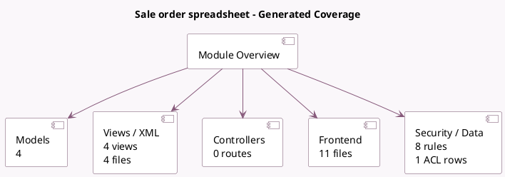

<!-- GENERATED:MODULE -->
---
tags: [odoo, enterprise, module]
---

# Sale order spreadsheet

- Scope: Enterprise Addons
- Source: enterprise/spreadsheet_sale_management
- Dependencies: [[docs/Enterprise Addons/spreadsheet_edition/spreadsheet_edition|spreadsheet_edition]], [[docs/Community Addons/sale_management/sale_management|sale_management]]

## Generated coverage

- Models: 4
- XML files with UI/data artifacts: 4
- Views: 4
- Actions: 1
- Menus: 1
- Rules (ir.rule): 8
- Access CSV entries: 1
- Controller units: 0
- Frontend asset files: 11

## Module map

## Detail notes

- Models: [[docs/Enterprise Addons/spreadsheet_sale_management/Models|Models]] (4)
- Views and XML: [[docs/Enterprise Addons/spreadsheet_sale_management/Views|Views]] (4 files)
- Frontend: [[docs/Enterprise Addons/spreadsheet_sale_management/Frontend|Frontend]] (11 files)

## Key models

- `sale.order`
- `sale.order.spreadsheet`
- `sale.order.template`
- `spreadsheet.cell.thread`

## Navigation

- [[../Enterprise Addons/Enterprise Addons|Back to scope]]
- [[../../docs/docs|Back to docs]]

<!-- GENERATED:MODULE -->

