<!-- GENERATED:MODEL -->
---
tags: [odoo, enterprise, generated, model]
---

# res.config.settings

- Module: [[docs/Enterprise Addons/stock_barcode/stock_barcode|stock_barcode]]
- Scope: Enterprise Addons
- Defined in module: extension only
- Source files: `models/res_config_settings.py`
- Python classes: `ResConfigSettings`

## Field footprint

- Detected fields: 7
- Field types: `Boolean` x 3, `Char` x 1, `Integer` x 2, `Many2one` x 1
- Relation fields: 1

## Sample fields

- `barcode_max_time_between_keys_in_ms`: `Integer` (comodel `Max time between each key`)
- `barcode_nomenclature_id`: `Many2one` (comodel `barcode.nomenclature`, related `company_id.nomenclature_id`)
- `barcode_rfid_batch_time`: `Integer` (comodel `RFID Timer`)
- `barcode_separator_regex`: `Char` (comodel `Multiscan Separator`)
- `show_barcode_nomenclature`: `Boolean` (compute `_compute_show_barcode_nomenclature`)
- `stock_barcode_demo_active`: `Boolean` (comodel `Demo Data Active`, compute `_compute_stock_barcode_demo_active`)
- `stock_barcode_mute_sound_notifications`: `Boolean` (comodel `Mute Barcode application sounds`)

## Method hints

- Detected methods: 2
- Action methods: none
- Compute methods: `_compute_show_barcode_nomenclature`, `_compute_stock_barcode_demo_active`
- Onchange methods: none

## Direct relation diagram

```plantuml
@startuml
!define ODOO_COLOR_PRIMARY #714B67
!define ODOO_COLOR_ACCENT #875A7B
!define ODOO_COLOR_BG #FAF7FA

skinparam backgroundColor ODOO_COLOR_BG
skinparam defaultTextAlignment left
skinparam ArrowColor ODOO_COLOR_ACCENT
skinparam ClassBackgroundColor white
skinparam ClassBorderColor ODOO_COLOR_PRIMARY
skinparam ComponentBackgroundColor white
skinparam ComponentBorderColor ODOO_COLOR_PRIMARY
skinparam NoteBackgroundColor #FFF8FF
skinparam NoteBorderColor ODOO_COLOR_ACCENT
skinparam SequenceLifeLineBorderColor ODOO_COLOR_ACCENT
skinparam SequenceLifeLineBackgroundColor #FFFFFF
skinparam SequenceParticipantBorderColor ODOO_COLOR_PRIMARY
skinparam SequenceParticipantBackgroundColor #FFFFFF
skinparam sequence {
  ArrowColor ODOO_COLOR_ACCENT
  ActorBorderColor ODOO_COLOR_PRIMARY
}
title res.config.settings - Direct Relations
class "res.config.settings" as res_config_settings
class "barcode.nomenclature" as barcode_nomenclature
res_config_settings --> barcode_nomenclature : barcode_nomenclature_id
@enduml
```

## Navigation

- **Parent:** [[docs/Enterprise Addons/stock_barcode/Models]]

<!-- GENERATED:MODEL -->
