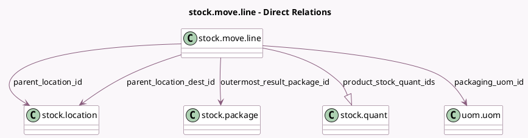

<!-- GENERATED:MODEL -->
---
tags: [odoo, enterprise, generated, model]
---

# stock.move.line

- Module: [[docs/Enterprise Addons/stock_barcode/stock_barcode|stock_barcode]]
- Scope: Enterprise Addons
- Defined in module: extension only
- Source files: `models/stock_move_line.py`
- Python classes: `StockMoveLine`

## Field footprint

- Detected fields: 17
- Field types: `Boolean` x 3, `Char` x 5, `Float` x 2, `Image` x 1, `Many2one` x 4, `One2many` x 1, `Properties` x 1
- Relation fields: 5

## Sample fields

- `dummy_id`: `Char` (compute `_compute_dummy_id`)
- `electronic_product_code`: `Char` (compute `_compute_electronic_product_code`)
- `formatted_product_barcode`: `Char` (compute `_compute_product_barcode`)
- `hide_lot`: `Boolean` (compute `_compute_hide_lot_name`)
- `hide_lot_name`: `Boolean` (compute `_compute_hide_lot_name`)
- `image_1920`: `Image` (related `product_id.image_1920`)
- `location_processed`: `Boolean`
- `lot_properties`: `Properties` (related `lot_id.lot_properties`)
- `outermost_result_package_id`: `Many2one` (comodel `stock.package`, compute `_compute_outermost_result_package_id`)
- `packaging_uom_id`: `Many2one` (comodel `uom.uom`, related `move_id.packaging_uom_id`)
- `packaging_uom_qty`: `Float` (related `move_id.packaging_uom_qty`)
- `parent_location_dest_id`: `Many2one` (comodel `stock.location`, compute `_compute_parent_location_id`)
- `parent_location_id`: `Many2one` (comodel `stock.location`, compute `_compute_parent_location_id`)
- `product_barcode`: `Char` (related `product_id.barcode`)
- `product_reference_code`: `Char` (related `product_id.code`)
- `product_stock_quant_ids`: `One2many` (comodel `stock.quant`, compute `_compute_product_stock_quant_ids`)
- `qty_done`: `Float` (compute `_compute_qty_done`)

## Method hints

- Detected methods: 15
- Action methods: none
- Compute methods: `_compute_dummy_id`, `_compute_electronic_product_code`, `_compute_hide_lot_name`, `_compute_outermost_result_package_id`, `_compute_parent_location_id`, `_compute_product_barcode`, `_compute_product_stock_quant_ids`, `_compute_qty_done`
- Onchange methods: none

## Direct relation diagram

## Navigation

- **Parent:** [[docs/Enterprise Addons/stock_barcode/Models]]

<!-- GENERATED:MODEL -->
