<!-- GENERATED:MODEL -->
---
tags: [odoo, enterprise, generated, model]
---

# stock_barcode.cancel.operation

- Module: [[docs/Enterprise Addons/stock_barcode/stock_barcode|stock_barcode]]
- Scope: Enterprise Addons
- Defined in module: yes
- Source files: `wizard/stock_barcode_cancel_operation.py`
- Python classes: `Stock_BarcodeCancelOperation`
- Description: Cancel Operation

## Field footprint

- Detected fields: 2
- Field types: `Char` x 1, `Many2one` x 1
- Relation fields: 1

## Sample fields

- `picking_id`: `Many2one` (comodel `stock.picking`)
- `picking_name`: `Char` (comodel `Transfer Name`, related `picking_id.display_name`)

## Method hints

- Detected methods: 1
- Action methods: `action_cancel_operation`
- Compute methods: none
- Onchange methods: none

## Direct relation diagram

```plantuml
@startuml
!define ODOO_COLOR_PRIMARY #714B67
!define ODOO_COLOR_ACCENT #875A7B
!define ODOO_COLOR_BG #FAF7FA

skinparam backgroundColor ODOO_COLOR_BG
skinparam defaultTextAlignment left
skinparam ArrowColor ODOO_COLOR_ACCENT
skinparam ClassBackgroundColor white
skinparam ClassBorderColor ODOO_COLOR_PRIMARY
skinparam ComponentBackgroundColor white
skinparam ComponentBorderColor ODOO_COLOR_PRIMARY
skinparam NoteBackgroundColor #FFF8FF
skinparam NoteBorderColor ODOO_COLOR_ACCENT
skinparam SequenceLifeLineBorderColor ODOO_COLOR_ACCENT
skinparam SequenceLifeLineBackgroundColor #FFFFFF
skinparam SequenceParticipantBorderColor ODOO_COLOR_PRIMARY
skinparam SequenceParticipantBackgroundColor #FFFFFF
skinparam sequence {
  ArrowColor ODOO_COLOR_ACCENT
  ActorBorderColor ODOO_COLOR_PRIMARY
}
title stock_barcode.cancel.operation - Direct Relations
class "stock_barcode.cancel.operation" as stock_barcode_cancel_operation
class "stock.picking" as stock_picking
stock_barcode_cancel_operation --> stock_picking : picking_id
@enduml
```

## Navigation

- **Parent:** [[docs/Enterprise Addons/stock_barcode/Models]]

<!-- GENERATED:MODEL -->
