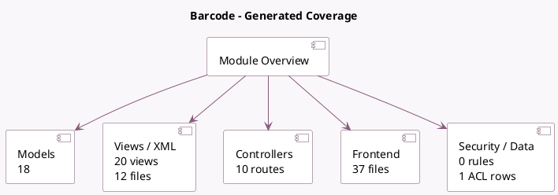

<!-- GENERATED:MODULE -->
---
tags: [odoo, enterprise, module]
---

# Barcode

- Scope: Enterprise Addons
- Source: enterprise/stock_barcode
- Dependencies: [[docs/Community Addons/stock/stock|stock]], [[docs/Community Addons/web_tour/web_tour|web_tour]], [[docs/Enterprise Addons/web_mobile/web_mobile|web_mobile]]

## Summary

Use barcode scanners to process logistics operations

## Generated coverage

- Models: 18
- XML files with UI/data artifacts: 12
- Views: 20
- Actions: 8
- Menus: 1
- Rules (ir.rule): 0
- Access CSV entries: 1
- Controller units: 1
- Frontend asset files: 37

## Module map

## Detail notes

- Models: [[docs/Enterprise Addons/stock_barcode/Models|Models]] (18)
- Views and XML: [[docs/Enterprise Addons/stock_barcode/Views|Views]] (12 files)
- Controllers: [[docs/Enterprise Addons/stock_barcode/Controllers|Controllers]] (1)
- Frontend: [[docs/Enterprise Addons/stock_barcode/Frontend|Frontend]] (37 files)

## Key models

- `product.product`
- `product.uom`
- `res.config.settings`
- `res.partner`
- `stock.backorder.confirmation`
- `stock.location`
- `stock.lot`
- `stock.move`
- `stock.move.line`
- `stock.package`
- `stock.package.type`
- `stock.picking`

## Navigation

- [[../Enterprise Addons/Enterprise Addons|Back to scope]]
- [[../../docs/docs|Back to docs]]

<!-- GENERATED:MODULE -->

## Curated analysis

### Functional role
- `stock_barcode` is the mobile execution layer for warehouse work: receipts, transfers, packages, lots, scrap, and location scans are driven from fast scanner-oriented screens.
- It extends the community stock engine rather than replacing it, so the operational value comes from speed and device ergonomics on top of the same reservation logic.

### Operational footprint
- `controllers/stock_barcode.py` exposes the barcode endpoints, while the model extensions adapt stock pickings, move lines, packages, and EPC encoding to scanning flows.
- The frontend is asset-heavy and depends on `web_mobile`, so behavior in real handheld devices matters as much as server-side model logic.

### Evidence
- Source files: `enterprise/stock_barcode/controllers/stock_barcode.py`, `enterprise/stock_barcode/models/stock_picking.py`, `enterprise/stock_barcode/models/stock_move_line.py`
- UI and device flows: `enterprise/stock_barcode/views/stock_barcode_views.xml`, `enterprise/stock_barcode/wizard/stock_backorder_confirmation.py`, `enterprise/stock_barcode/static/src/**/*`
- Tests: `enterprise/stock_barcode/tests/test_controller.py`, `enterprise/stock_barcode/tests/test_barcode.py`, `enterprise/stock_barcode/tests/test_barcode_client_action_picking.py`

### Related notes
- `[[docs/Community Addons/stock/stock|stock]]`
- `[[docs/Core/Processes/Inventory/Inventory]]`

### Rollout and migration concerns
- Scanner formats, GS1 rules, and package or lot requirements should be validated with the exact warehouse flows in use, not only with demo data.
- Mobile-device rollout needs operational testing on network coverage, camera scanners, and multi-company context because those conditions shape the real barcode experience.
- Legacy comparison backlog was retired on 2026-03-02; keep this note focused on the current codebase.

