<!-- GENERATED:MODEL -->
---
tags: [odoo, enterprise, generated, model]
---

# mrp.production

- Module: [[docs/Enterprise Addons/stock_barcode_mrp/stock_barcode_mrp|stock_barcode_mrp]]
- Scope: Enterprise Addons
- Defined in module: extension only
- Source files: `models/mrp_production.py`
- Python classes: `MrpProduction`

## Field footprint

- Detected fields: 4
- Field types: `Boolean` x 1, `One2many` x 3
- Relation fields: 3

## Sample fields

- `backorder_ids`: `One2many` (related `production_group_id.production_ids`)
- `is_completed`: `Boolean` (compute `_compute_is_completed`)
- `move_byproduct_line_ids`: `One2many` (comodel `stock.move.line`, compute `_compute_move_byproduct_line_ids`)
- `move_raw_line_ids`: `One2many` (comodel `stock.move.line`, compute `_compute_move_raw_line_ids`)

## Method hints

- Detected methods: 10
- Action methods: `action_open_barcode_client_action`
- Compute methods: `_compute_is_completed`, `_compute_move_byproduct_line_ids`, `_compute_move_raw_line_ids`
- Onchange methods: none

## Direct relation diagram

```plantuml
@startuml
!define ODOO_COLOR_PRIMARY #714B67
!define ODOO_COLOR_ACCENT #875A7B
!define ODOO_COLOR_BG #FAF7FA

skinparam backgroundColor ODOO_COLOR_BG
skinparam defaultTextAlignment left
skinparam ArrowColor ODOO_COLOR_ACCENT
skinparam ClassBackgroundColor white
skinparam ClassBorderColor ODOO_COLOR_PRIMARY
skinparam ComponentBackgroundColor white
skinparam ComponentBorderColor ODOO_COLOR_PRIMARY
skinparam NoteBackgroundColor #FFF8FF
skinparam NoteBorderColor ODOO_COLOR_ACCENT
skinparam SequenceLifeLineBorderColor ODOO_COLOR_ACCENT
skinparam SequenceLifeLineBackgroundColor #FFFFFF
skinparam SequenceParticipantBorderColor ODOO_COLOR_PRIMARY
skinparam SequenceParticipantBackgroundColor #FFFFFF
skinparam sequence {
  ArrowColor ODOO_COLOR_ACCENT
  ActorBorderColor ODOO_COLOR_PRIMARY
}
title mrp.production - Direct Relations
class "mrp.production" as mrp_production
class "stock.move.line" as stock_move_line
mrp_production --|> stock_move_line : move_raw_line_ids
mrp_production --|> stock_move_line : move_byproduct_line_ids
@enduml
```

## Navigation

- **Parent:** [[docs/Enterprise Addons/stock_barcode_mrp/Models]]

<!-- GENERATED:MODEL -->
