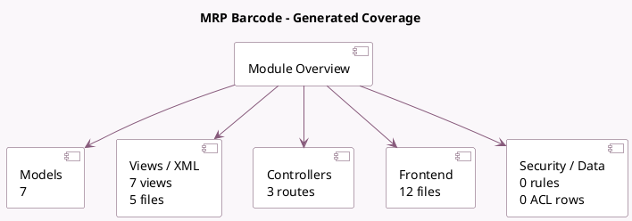

<!-- GENERATED:MODULE -->
---
tags: [odoo, enterprise, module]
---

# MRP Barcode

- Scope: Enterprise Addons
- Source: enterprise/stock_barcode_mrp
- Dependencies: [[docs/Enterprise Addons/stock_barcode/stock_barcode|stock_barcode]], [[docs/Community Addons/mrp/mrp|mrp]]

## Summary

Process Manufacturing Orders from the barcode application

## Generated coverage

- Models: 7
- XML files with UI/data artifacts: 5
- Views: 7
- Actions: 3
- Menus: 0
- Rules (ir.rule): 0
- Access CSV entries: 0
- Controller units: 1
- Frontend asset files: 12

## Module map

## Detail notes

- Models: [[docs/Enterprise Addons/stock_barcode_mrp/Models|Models]] (7)
- Views and XML: [[docs/Enterprise Addons/stock_barcode_mrp/Views|Views]] (5 files)
- Controllers: [[docs/Enterprise Addons/stock_barcode_mrp/Controllers|Controllers]] (1)
- Frontend: [[docs/Enterprise Addons/stock_barcode_mrp/Frontend|Frontend]] (12 files)

## Key models

- `mrp.production`
- `mrp.production.backorder`
- `product.product`
- `stock.move`
- `stock.move.line`
- `stock.picking`
- `stock.picking.type`

## Navigation

- [[../Enterprise Addons/Enterprise Addons|Back to scope]]
- [[../../docs/docs|Back to docs]]

<!-- GENERATED:MODULE -->

