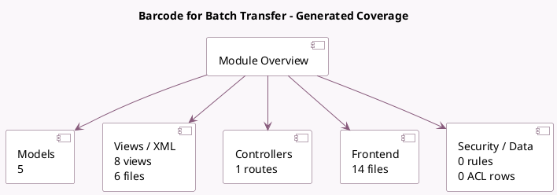

<!-- GENERATED:MODULE -->
---
tags: [odoo, enterprise, module]
---

# Barcode for Batch Transfer

- Scope: Enterprise Addons
- Source: enterprise/stock_barcode_picking_batch
- Dependencies: [[docs/Enterprise Addons/stock_barcode/stock_barcode|stock_barcode]], [[docs/Community Addons/stock_picking_batch/stock_picking_batch|stock_picking_batch]]

## Summary

Add the support of batch transfers into the barcode view

## Generated coverage

- Models: 5
- XML files with UI/data artifacts: 6
- Views: 8
- Actions: 2
- Menus: 0
- Rules (ir.rule): 0
- Access CSV entries: 0
- Controller units: 1
- Frontend asset files: 14

## Module map

## Detail notes

- Models: [[docs/Enterprise Addons/stock_barcode_picking_batch/Models|Models]] (5)
- Views and XML: [[docs/Enterprise Addons/stock_barcode_picking_batch/Views|Views]] (6 files)
- Controllers: [[docs/Enterprise Addons/stock_barcode_picking_batch/Controllers|Controllers]] (1)
- Frontend: [[docs/Enterprise Addons/stock_barcode_picking_batch/Frontend|Frontend]] (14 files)

## Key models

- `stock.move.line`
- `stock.picking`
- `stock.picking.batch`
- `stock.picking.type`
- `stock_barcode.cancel.operation`

## Navigation

- [[../Enterprise Addons/Enterprise Addons|Back to scope]]
- [[../../docs/docs|Back to docs]]

<!-- GENERATED:MODULE -->

