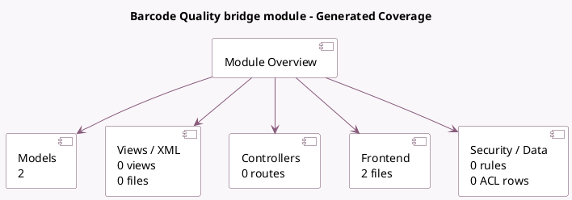

<!-- GENERATED:MODULE -->
---
tags: [odoo, enterprise, module]
---

# Barcode Quality bridge module

- Scope: Enterprise Addons
- Source: enterprise/stock_barcode_quality_control
- Dependencies: [[docs/Enterprise Addons/stock_barcode/stock_barcode|stock_barcode]], [[docs/Enterprise Addons/quality_control/quality_control|quality_control]]

## Summary

Allows the usage of quality checks within the barcode views

## Generated coverage

- Models: 2
- XML files with UI/data artifacts: 0
- Views: 0
- Actions: 0
- Menus: 0
- Rules (ir.rule): 0
- Access CSV entries: 0
- Controller units: 0
- Frontend asset files: 2

## Module map

## Detail notes

- Models: [[docs/Enterprise Addons/stock_barcode_quality_control/Models|Models]] (2)
- Frontend: [[docs/Enterprise Addons/stock_barcode_quality_control/Frontend|Frontend]] (2 files)

## Key models

- `stock.move.line`
- `stock.picking`

## Navigation

- [[../Enterprise Addons/Enterprise Addons|Back to scope]]
- [[../../docs/docs|Back to docs]]

<!-- GENERATED:MODULE -->

