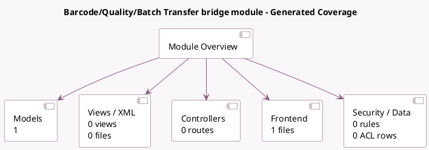

<!-- GENERATED:MODULE -->
---
tags: [odoo, enterprise, module]
---

# Barcode/Quality/Batch Transfer bridge module

- Scope: Enterprise Addons
- Source: enterprise/stock_barcode_quality_control_picking_batch
- Dependencies: [[docs/Enterprise Addons/quality_control_picking_batch/quality_control_picking_batch|quality_control_picking_batch]], [[docs/Enterprise Addons/stock_barcode_quality_control/stock_barcode_quality_control|stock_barcode_quality_control]]

## Generated coverage

- Models: 1
- XML files with UI/data artifacts: 0
- Views: 0
- Actions: 0
- Menus: 0
- Rules (ir.rule): 0
- Access CSV entries: 0
- Controller units: 0
- Frontend asset files: 1

## Module map

## Detail notes

- Models: [[docs/Enterprise Addons/stock_barcode_quality_control_picking_batch/Models|Models]] (1)
- Frontend: [[docs/Enterprise Addons/stock_barcode_quality_control_picking_batch/Frontend|Frontend]] (1 files)

## Key models

- `stock.picking.batch`

## Navigation

- [[../Enterprise Addons/Enterprise Addons|Back to scope]]
- [[../../docs/docs|Back to docs]]

<!-- GENERATED:MODULE -->

