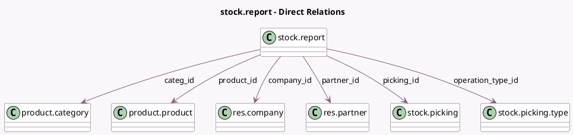

<!-- GENERATED:MODEL -->
---
tags: [odoo, enterprise, generated, model]
---

# stock.report

- Module: [[docs/Enterprise Addons/stock_enterprise/stock_enterprise|stock_enterprise]]
- Scope: Enterprise Addons
- Defined in module: yes
- Source files: `report/stock_report.py`
- Python classes: `StockReport`
- Description: Stock Report

## Field footprint

- Detected fields: 18
- Field types: `Boolean` x 2, `Char` x 2, `Datetime` x 3, `Float` x 3, `Many2one` x 6, `Selection` x 2
- Relation fields: 6

## Sample fields

- `categ_id`: `Many2one` (comodel `product.category`)
- `company_id`: `Many2one` (comodel `res.company`)
- `creation_date`: `Datetime` (comodel `Creation Date`)
- `cycle_time`: `Float` (comodel `Cycle Time (Days)`)
- `date_done`: `Datetime` (comodel `Transfer Date`)
- `delay`: `Float` (comodel `Delay (Days)`)
- `is_backorder`: `Boolean` (comodel `Is a Backorder`)
- `is_late`: `Boolean` (comodel `Is Late`)
- `operation_type_id`: `Many2one` (comodel `stock.picking.type`)
- `partner_id`: `Many2one` (comodel `res.partner`)
- `picking_id`: `Many2one` (comodel `stock.picking`)
- `picking_name`: `Char` (comodel `Picking Name`)
- `picking_type_code`: `Selection`
- `product_id`: `Many2one` (comodel `product.product`)
- `product_qty`: `Float` (comodel `Product Quantity`)
- `reference`: `Char` (comodel `Reference`)
- `scheduled_date`: `Datetime` (comodel `Expected Date`)
- `state`: `Selection`

## Method hints

- Detected methods: 5
- Action methods: none
- Compute methods: `_compute_display_name`
- Onchange methods: none

## Direct relation diagram

## Navigation

- **Parent:** [[docs/Enterprise Addons/stock_enterprise/Models]]

<!-- GENERATED:MODEL -->
